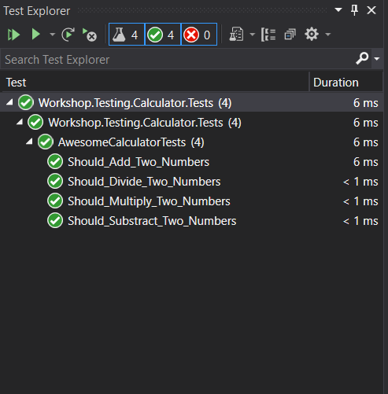
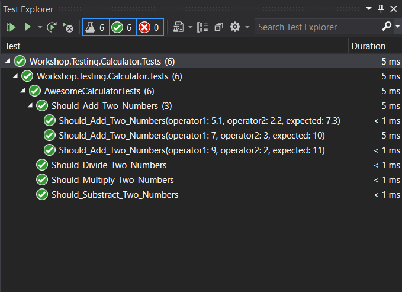
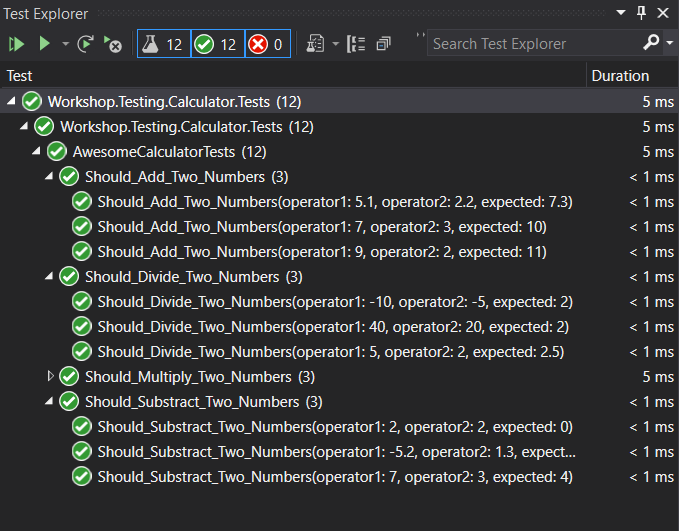
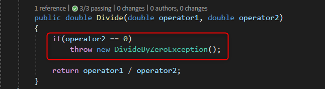

# Lab 1 - Creación de Unit Tests para la clase AwesomeCalculator

En este ejercicio vamos a crear tests unitarios para nuestra clase AwesomeCalculator.

Partimos de un proyecto de librería de clases en C# **Workshop.Testing.Calculator** que contiene una clase [AwesomeCalculator.cs](before/Workshop.Testing.Calculator/AwesomeCalculator.cs) con cuatro métodos:

````csharp
 public double Add(double operator1, double operator2)
 
 public double Substract(double operator1, double operator2)
 
 public double Multiply(double operator1, double operator2)

 public double Divide(double operator1, double operator2)
 
````

En este ejercicio vamos a crear un proyecto de tests de xUnit con cuatro tests unitarios para comprobar cada uno de los métodos de nuestra clase AwesomeCalculator.

## Paso 1. Crear el proyecto de Tests de XUnit

Dentro de la carpeta raíz del ejercicio crearemos un proyecto de XUnit llamado Workshop.Testing.Calculator.Tests


## Paso 2. Añadir la referencia a la librería de clases

En nuestro proyecto de XUnit deberemos añadir una referencia al proyecto en donde se encuentra la clase Calculator.

## Paso 3. Sobreescribir la clase UnitTest1.cs

Al crear el proyecto de XUnit, automáticamente se habrá creado una clase llamada UnitTest1.cs, vamos a renombrar el archivo por **AwesomeCalculatorTests.cs**, nos quedará algo así:

````csharp

using System;
using Xunit;

namespace Workshop.Testing.Calculator.Tests
{
    public class AwesomeCalculatorTests
    {
        [Fact]
        public void Test1()
        {

        }
    }
}

````

**NOTA**: Para que XUnit reconozca los métodos que creemos como métodos de test y los ejecute deberemos decorarlos con el atributo **Fact**

## Paso 4. Crear Tests para los métodos de la clase AwesomeCalculator.

vamos a empezar a crear los tests para la clase calculator, primero vamos a crear un test para el método Add:

````csharp
        [Fact]
        public void Should_Add_Two_Numbers()
        {
            // Arrange
            double operator1 = 2;
            double operator2 = 9;
            double expected = 11;
            AwesomeCalculator systemUnderTest = new AwesomeCalculator();
            
            // Act
            var result = systemUnderTest.Add(operator1, operator2);
            
            // Assert
            Assert.Equal(expected, result);
        }
````
Si te fijas en el código, está estructurado en tres secciones diferentes:

-   Arrange (organiza)
-   Act (actúa)
-   Assert (comprueba)

Esta forma de estructurar el código de los tests se llama AAA, puedes encontrar más información [aquí](https://geeks.ms/jorge/2018/08/25/unit-testing-y-el-patron-aaa/)

Vamos a seguir creando otro test para el método Substract:

````csharp
        [Fact]
        public void Should_Substract_Two_Numbers()
        {
            // Arrange
            double operator1 = 7;
            double operator2 = 3;
            double expected = 4;
            AwesomeCalculator systemUnderTest = new AwesomeCalculator();

            // Act
            var result = systemUnderTest.Substract(operator1, operator2);

            // Assert
            Assert.Equal(expected, result);
        }
````

seguimos probando la clase, ahora introducimos un test para la multiplicación:

`````csharp
        [Fact]
        public void Should_Multiply_Two_Numbers()
        {
            // Arrange
            double operator1 = 7;
            double operator2 = 8;
            double expected = 56;
            AwesomeCalculator systemUnderTest = new AwesomeCalculator();

            // Act
            var result = systemUnderTest.Multiply(operator1, operator2);

            // Assert
            Assert.Equal(expected, result);
        }

`````

por último, añadimos el test para la división

````csharp
        [Fact]
        public void Should_Divide_Two_Numbers()
        {
            // Arrange
            double operator1 = 40;
            double operator2 = 20;
            double expected = 2;
            AwesomeCalculator systemUnderTest = new AwesomeCalculator();

            // Act
            var result = systemUnderTest.Divide(operator1, operator2);

            // Assert
            Assert.Equal(expected, result);
        }
````

Si todo ha ido bien, al ejecutar nuestros tests en el Test Runner de Visual Studio nos debería aparecer algo similar a esto:



## Paso 5. Testear múltiples parámetros de entrada usando teorías

Si queremos utilizar varios juegos de valores para probar nuestros componentes, XUnit nos da la opción decorando nuestros métodos en vez de con el atributo **Fact** con los atributos **Theory** e **InlineData**. Vamos a cambiar los métodos de nuestra clase **AwesomeCalculatorTests** para que acepten diferentes parámetros de entrada, empezando con la prueba del método **Add**:

````csharp

        [Theory]
        [InlineData(9,2,11)]
        [InlineData(7,3,10)]
        [InlineData(5.1, 2.2, 7.3)]
        public void Should_Add_Two_Numbers(double operator1,double operator2,double expected)
        {
            // Arrange                                    
            AwesomeCalculator systemUnderTest = new AwesomeCalculator();
            
            // Act
            var result = systemUnderTest.Add(operator1, operator2);
            
            // Assert
            Assert.Equal(expected, result);
        }

````

Si ejecutamos los tests podremos ver que el test para el método Add se ha ejecutado 3 veces, una por cada juego de datos que hemos proporcionado con el atributo **InlineData**



Vamos a modificar los demás métodos de la clase de test para que ejecuten varias pruebas con diferentes valores:

````csharp

        [Theory]
        [InlineData(7,3,4)]
        [InlineData(2,2,0)]
        [InlineData(-5.2,1.3,-6.5)]        
        public void Should_Substract_Two_Numbers(double operator1, double operator2, double expected)
        {
            // Arrange
            AwesomeCalculator systemUnderTest = new AwesomeCalculator();

            // Act
            var result = systemUnderTest.Substract(operator1, operator2);

            // Assert
            Assert.Equal(expected, result);
        }

        [Theory]
        [InlineData(2,4,8)]
        [InlineData(8, 7, 56)]
        [InlineData(-7, -7, 49)]
        public void Should_Multiply_Two_Numbers(double operator1, double operator2, double expected)
        {
            // Arrange
            AwesomeCalculator systemUnderTest = new AwesomeCalculator();

            // Act
            var result = systemUnderTest.Multiply(operator1, operator2);

            // Assert
            Assert.Equal(expected, result);
        }

        [Theory]
        [InlineData(40,20,2)]
        [InlineData(5, 2, 2.5)]
        [InlineData(-10,-5,2)]
        public void Should_Divide_Two_Numbers(double operator1, double operator2, double expected)
        {
            // Arrange
            AwesomeCalculator systemUnderTest = new AwesomeCalculator();

            // Act
            var result = systemUnderTest.Divide(operator1, operator2);

            // Assert
            Assert.Equal(expected, result);
        }

````
Si ejecutamos estas pruebas con Visual Studio obtendremos este resultado:



Genial, hasta aquí bien, hemos escrito pruebas para todos los métodos de nuestra clase **AwesomeCalculator**, pero si le echamos un vistazo al método **Divide**, hay algo que estamos pasando por alto:



¿Cómo podemos probar que si el divisor es cero obtendremos una excepción de tipo **DivideByZeroException**?

## Paso 6. Comprobar excepciones desde nuestros tests.

Para comprobar que nuestro método devuelve una excepción cuando intentamos dividir por cero, podremos hacer uso de la función **Assert.Throws(_método que devuelve error_)**

Vamos a crear un nuevo test para comprobar esta lógica, dentro de nuestra clase de tests:

````csharp
        [Fact]
        public void Should_Throw_DivideByZeroException_When_Trying_To_Divide_By_Zero()
        {
            // Arrange
            double operator1 = 2;
            double operator2 = 0;
            AwesomeCalculator systemUnderTest = new AwesomeCalculator();

            // Act
            Action divide = () => systemUnderTest.Divide(operator1, operator2);

            // Assert
            Assert.Throws<DivideByZeroException>(divide);
        }
````

Fíjate, para continuar usando el patrón AAA de organización de nuestros tests, hemos usado un delegado **Action** que ejecutamos en la comprobación. 

Aunque al principio el patrón AAA es muy interesante ya que nos permite visualizar el propósito de cada sección dentro de nuestro método, a medida que vayas añadiendo más tests y vayas refactorizando el código de los tests, es probable que no sea necesario cumplir estrictamente con las tres secciones de organización dentro del test.

## Paso 7. Refactorización

Bueno, ya tenemos cubierto el 100% del código de nuestra clase AwesomeCalculator por nuestros Tests, pero si miramos el código fuente de los tests hay algo que no termina de cuadrar del todo, estamos repitiendo la creación del objeto AwesomeCalculator en cada uno de los tests, no podríamos hacerlo más simple?

Teniendo en cuenta que **XUnit crea una nueva instancia de nuestra clase de test por cada test unitario que se ejecuta** podríamos:

1. Crear una propiedad privada de nuestra clase de test de tipo AwesomeCalculator.
2. Definir el constructor de la clase de Test e instanciar allí la propiedad.
3. Eliminar la creación de la variable AwesomeCalculator en todos los tests.

Aunque para este ejemplo casi no tiene sentido, es interesante que conozcas esta característica de XUnit.

Aquí tienes el código de la clase de test completa:

````csharp
    public class AwesomeCalculatorTests
    {
        private AwesomeCalculator systemUnderTest;
        public AwesomeCalculatorTests()
        {
            systemUnderTest = new AwesomeCalculator();
        }

        [Theory]
        [InlineData(9,2,11)]
        [InlineData(7,3,10)]
        [InlineData(5.1, 2.2, 7.3)]
        public void Should_Add_Two_Numbers(double operator1,double operator2,double expected)
        {            
            // Act
            var result = systemUnderTest.Add(operator1, operator2);
            
            // Assert
            Assert.Equal(expected, result);
        }

        [Theory]
        [InlineData(7,3,4)]
        [InlineData(2,2,0)]
        [InlineData(-5.2,1.3,-6.5)]        
        public void Should_Substract_Two_Numbers(double operator1, double operator2, double expected)
        {            
            // Act
            var result = systemUnderTest.Substract(operator1, operator2);

            // Assert
            Assert.Equal(expected, result);
        }

        [Theory]
        [InlineData(2,4,8)]
        [InlineData(8, 7, 56)]
        [InlineData(-7, -7, 49)]
        public void Should_Multiply_Two_Numbers(double operator1, double operator2, double expected)
        {            
            // Act
            var result = systemUnderTest.Multiply(operator1, operator2);

            // Assert
            Assert.Equal(expected, result);
        }

        [Theory]
        [InlineData(40,20,2)]
        [InlineData(5, 2, 2.5)]
        [InlineData(-10,-5,2)]
        public void Should_Divide_Two_Numbers(double operator1, double operator2, double expected)
        {            
            // Act
            var result = systemUnderTest.Divide(operator1, operator2);

            // Assert
            Assert.Equal(expected, result);
        }

        [Fact]
        public void Should_Throw_DivideByZeroException_When_Trying_To_Divide_By_Zero()
        {            
            // Arrange
            double operator1 = 2;
            double operator2 = 0;            

            // Act
            Action divide = () => systemUnderTest.Divide(operator1, operator2);

            // Assert
            Assert.Throws<DivideByZeroException>(divide);
        }
    }
````

Genial! ya has completado el primer lab y te has familiarizado con algunos conceptos de XUnit.
