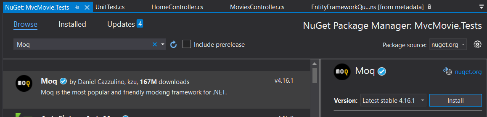
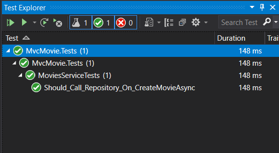
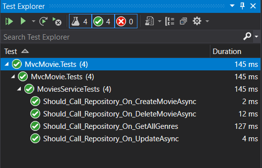
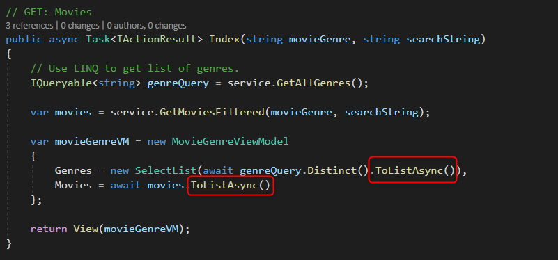

# Lab2. Simular dependencias con Moq

En este Lab vamos a ver cómo podemos simular las dependencias de un objeto para poder testearlo aisladamente utilizando la librería [Moq](https://github.com/moq/moq).

Para ello vamos a partir de un ejemplo de web en Asp.NET Core MVC que tiene el equipo de AspNet Core en su repo de GitHub, al que le he hecho algunas modificaciones para que sea más sencillo trabajar con él en este Lab.

Este proyecto de ejemplo contiene una Web en Asp.NET Core MVC que presenta un listado de películas que obtiene de una base de datos Sql Server utilizando Entity Framework Core, y ofrece al usuario las siguientes funcionalidades:

- Buscar todas las películas.
- Filtrar las películas por género o por título.
- Ver/Editar los datos de una película.
- Eliminar una película.
- Crear una película nueva.

Si echamos un vistazo al proyecto, podremos ver que la lógica está dividida en tres capas principales:

- MoviesController -> Recibe las peticiones Web, llama al componente de servicio MoviesService y devuelve el resultado a la vista
- MoviesService -> Recibe las peticiones del controlador, realiza alguna acción adicional si es necesario, y enruta las peticiones a la capa de repositorio.
- MoviesRepository -> Recibe las solicitudes de la capa de servicio y comunica con el contexto de entity framework para atacar a la base de datos.

Vamos a empezar primero escribiendo tests unitarios para el objeto MoviesService.

## Paso 0. Crear el proyecto de Tests de xUnit

Dentro de la carpeta raíz del ejercicio crearemos un proyecto de XUnit llamado **MvcMovie.Tests** y añadiremos una referencia al proyecto de **MvcMovie**

## Paso 1. Añadir el paquete nuget de Moq:

En el proyecto de tests vamos añadir el paquete nuget de Moq



## Paso 2. Sobreescribir la clase UnitTest

Vamos a renombrar el fichero (y la clase) **UnitTest** por **MoviesServiceTests**

## Paso 3. Crear un test para el método **CreateMovieAsync**

Vamos a empezar escribiendo un test muy sencillo, vamos a comprobar que cuando llamemos al método **CreateMovieAsync** de nuestra clase **MoviesService**, ésta a su vez llama al método **CreateMovieAsync** de la capa de repositorio.

Para ello, dentro del fichero de tests **MoviesServiceTests** vamos a renombrar el test **Test1** por lo siguiente:

````csharp
        [Fact]
        public async Task Should_Call_Repository_On_CreateMovieAsync()
        {

        }        
````

dentro del test, en la sección de **Arrange**, vamos a definir esta variable:
````csharp
    Mock<IMoviesRepository> mockMovieRepository = new Mock<IMoviesRepository>(MockBehavior.Loose);      
````
con esta variable definimos un sustituto para nuestra interfaz IMoviesRepository. En el constructor le estamos diciendo que el comportamiento del Mock debe ser flexible, para que no lance excepciones si se llaman a métodos de la interfaz que estamos simulando que no hemos configurado en el Mock.

Después de esto, creamos una instancia de nuestra clase **MoviesService** y le inyectamos el mock en su constructor, usando la propiedad **Object** del mock:

````csharp
    MoviesService systemUnderTest = new MoviesService(mockMovieRepository.Object);
````

Ahora vamos a pasar a la sección **Act** , donde vamos a llamar al método **CreateMovieAsync** del servicio que vamos a testear:
````csharp
    await systemUnderTest.CreateMovieAsync(new Models.Movie());
````  

Por último, en la sección **Assert**, vamos a comprobar que nuestro servicio ha llamado al método **CreateMovieAsync** de la capa de repositorio pasándole un objeto de tipo **Movie** una sola vez:
````csharp
    mockMovieRepository.Verify(x => x.CreateMovieAsync(It.IsAny<Movie>()), Times.Once());
````    
Si ejecutamos el test podremos ver que ha ido bien:



Este es el código del test completo:
````csharp
        [Fact]
        public async Task Should_Call_Repository_On_CreateMovieAsync()
        {
            // Arrange
            Mock<IMoviesRepository> mockMovieRepository = new Mock<IMoviesRepository>(MockBehavior.Loose);
            MoviesService systemUnderTest = new MoviesService(mockMovieRepository.Object);

            // Act
            await systemUnderTest.CreateMovieAsync(new Models.Movie());

            // Assert
            mockMovieRepository.Verify(x => x.CreateMovieAsync(It.IsAny<Movie>()), Times.Once());
        }
````  
## Paso 4. Crear tests para los métodos DeleteMovieAsync, GetAllGenres y UpdateMovieAsync

Utilizando lo mismo que hemos visto en el paso anterior, añade un test para cada uno de los métodos de la clase **MoviesService**:

- DeleteMovieAsync
- GetAllGenres
- UpdateMovieAsync

Cuando hayas terminado, ejecuta los tests, debería salirte algo similar a esto:



Si te atascas, te muestro la solución aquí abajo:

````csharp
        [Fact]
        public async Task Should_Call_Repository_On_DeleteMovieAsync()
        {
            // Arrange
            Mock<IMoviesRepository> mockMovieRepository = new Mock<IMoviesRepository>(MockBehavior.Loose);
            MoviesService systemUnderTest = new MoviesService(mockMovieRepository.Object);

            // Act
            await systemUnderTest.DeleteMovieAsync(0);

            // Assert
            mockMovieRepository.Verify(x => x.DeleteAsync(It.IsAny<int>()), Times.Once());
        }

        [Fact]
        public void Should_Call_Repository_On_GetAllGenres()
        {
            // Arrange
            Mock<IMoviesRepository> mockMovieRepository = new Mock<IMoviesRepository>(MockBehavior.Loose);
            MoviesService systemUnderTest = new MoviesService(mockMovieRepository.Object);

            // Act
            var result = systemUnderTest.GetAllGenres();

            // Assert
            mockMovieRepository.Verify(x => x.GetAllGenres(), Times.Once());
        }

        [Fact]
        public async Task Should_Call_Repository_On_UpdateAsync()
        {
            // Arrange
            Mock<IMoviesRepository> mockMovieRepository = new Mock<IMoviesRepository>(MockBehavior.Loose);
            MoviesService systemUnderTest = new MoviesService(mockMovieRepository.Object);

            // Act
            await systemUnderTest.UpdateMovieAsync(new Movie());

            // Assert
            mockMovieRepository.Verify(x => x.UpdateMovieAsync(It.IsAny<Movie>()), Times.Once());
        }
````

## Paso 5. Crear tests para el método GetMovie
Vamos a seguir escribiendo tests para nuestra clase de **MoviesService** en este caso para el método GetMovie, si nos fijamos en el código que contiene el método:

````csharp
        public async Task<Movie> GetMovie(int? id)
        {
            if (id == null)
            {
                throw new MovieNotFoundException();
            }
            Movie movie = await repository.GetByIdAsync(id);
            if(movie == null)
            {
                throw new MovieNotFoundException();
            }
            return movie;
        }
````
podríamos escribir tres tests unitarios:

- Cuando la variable id es nula, se debe generar una excepción de tipo MovieNotFoundException.
- Cuando el repositorio encuentra una película que cuadra con el id, el método devuelve la película.
- Cuando la película no se encuentra en la base de datos, se debe generar una excepción de tipo MovieNotFoundException.

### 5.1. Comprobar que se eleva una excepción si el id es nulo

Vamos a empezar escribiendo un test para el primer caso:

````csharp
        [Fact]
        public async Task Should_Throw_MovieNotFoundException_On_GetMovie_When_Id_Is_Null()
        {

        }
````
dentro de la sección Arrange vamos a escribir lo mismo que en los tests anteriores:

````csharp
            // Arrange
            Mock<IMoviesRepository> mockMovieRepository = new Mock<IMoviesRepository>(MockBehavior.Loose);
            MoviesService systemUnderTest = new MoviesService(mockMovieRepository.Object);
````

Para la sección **Act**, como tenemos que comprobar que se eleva la excepción al pasarle un nulo, pero el método es asíncrono, no podemos utilizar lo mismo que vimos en el Lab 1, sino algo bastante parecido, en vez de definirnos una Action nos definiremos una Task:

````csharp
            // Act
            Task getMovie = systemUnderTest.GetMovie(null);
````

Por último, para la sección de **Assert**, podremos comprobar que realmente se lanza la excepción usando el método **ThrowsAsync** de la clase **Assert**:

````csharp
            // Assert
            await Assert.ThrowsAsync<MovieNotFoundException>(() =>  getMovie);
````
Èl código completo del test está aquí debajo:

````csharp
        [Fact]
        public async Task Should_Throw_MovieNotFoundException_On_GetMovie_When_Id_Is_Null()
        {
            // Arrange
            Mock<IMoviesRepository> mockMovieRepository = new Mock<IMoviesRepository>(MockBehavior.Loose);            
            MoviesService systemUnderTest = new MoviesService(mockMovieRepository.Object);

            // Act
            Task getMovie = systemUnderTest.GetMovie(null);

            // Assert
            await Assert.ThrowsAsync<MovieNotFoundException>(() =>  getMovie);

        }
````

### Paso 5.2. Comprobar que se devuelve una película cuando la encuentra el repositorio

Vamos a escribir otro test para el segundo caso:

````csharp
        [Fact]
        public async Task Should_Return_Movie_On_GetMovie_When_Repository_Found_It()
        {

        }
````

Para la sección **Arrange** vamos a definir lo siguiente:

````csharp
            // Arrange
            int id = 1;
            Movie expected = new Movie();
            Mock<IMoviesRepository> mockMovieRepository = new Mock<IMoviesRepository>(MockBehavior.Loose);
            mockMovieRepository.Setup(x => x.GetByIdAsync(id)).Returns(Task.FromResult(expected));
            MoviesService systemUnderTest = new MoviesService(mockMovieRepository.Object);
````

Si te fijas, estamos configurando el mock de IMoviesRepository para que cuando se llame a su método **GetByIdAsync** pasándole un id específico (representado por la variable **id**), éste nos devuelva una instancia de la clase **Movie** (representada por la variable **expected**).

En la sección **Act**  declaramos una variable **returnValue** y llamamos al método **GetByIdAsync** de nuestra clase **MoviesService**:

````csharp
            // Act
            Movie returnValue =await systemUnderTest.GetMovie(id);
````
En la sección **Assert** comprobamos que el valor devuelto por el método de nuestra clase de servicio es igual que el valor que hemos configurado en el mock:

````csharp
            // Assert
            Assert.Equal(expected, returnValue);
````

### Paso 5.3. Comprobar que se devuelve una excepción cuando el repositorio no encuentra la película.

Para este último test del método **GetMovie** habría que combinar lo que hemos hecho en los dos tests anteriores:

- Configurar el mock para que cuando se llame a su método **GetByIdAsync** devuelva un nulo
- Comprobar que al llamar al método con un id que no es nulo se eleva una excepción.

Aquí te paso la cabecera del test:

````csharp
        [Fact]
        public async Task Should_Throw_MovieNotFoundException_On_GetMovie_When_NoMovie_Is_Found()
        {

        }
````

Codifícalo tu, y si ves que te atascas, te paso **una de las soluciones** aquí abajo:

````csharp
        [Fact]
        public async Task Should_Throw_MovieNotFoundException_On_GetMovie_When_NoMovie_Is_Found()
        {
            // Arrange
            int id = 1;   
            Movie expected = null;         
            Mock<IMoviesRepository> mockMovieRepository = new Mock<IMoviesRepository>(MockBehavior.Loose);
            mockMovieRepository.Setup(x => x.GetByIdAsync(id)).Returns(Task.FromResult(expected));
            MoviesService systemUnderTest = new MoviesService(mockMovieRepository.Object);

            // Act
            Task getMovie = systemUnderTest.GetMovie(id);

            // Assert
            await Assert.ThrowsAsync<MovieNotFoundException>(() => getMovie);
        }
````

Y digo que te paso una de las soluciones, porque en realidad en este caso no sería necesario llamar al método **Setup** del mock para configurarlo, ya que al estar definiendo el Mock con un comportamiento _flexible_, esto significa que el mock no generará excepciones al llamar a métodos que no han sido configurados, pero devolverá valores por defecto,que en nuestro caso serían valores nulos. Prueba a comentar la línea en la que realizas el Setup y a ejecutar de nuevo el test, verás como sigue funcionando correctamente.

## Paso 6. Crear tests para el método GetMoviesFiltered

Para terminar de cubrir con test toda nuestra clase **MoviesService** nos faltaría el método **GetMoviesFiltered**. Prueba a crear tres métodos que comprueben que se puede filtrar por género, por título y por ambos.

Aquí tienes una posible solución:

````csharp

        const string GENRE_DRAMA = "Drama";
        const string GENRE_ACTION = "Action";
        private Movie GetTerminatorMovie()
        {
            return new Movie() { Genre = GENRE_ACTION, Title = "Terminator 2" };
        }
        private Movie GetMillionDollarBabyMovie()
        {
            return new Movie() { Genre = "Drama", Title = "Million Dollar Baby" };
        }
        [Fact]
        public void Should_Filter_Movies_By_Genre()
        {
            // Arrange
            List<Movie> movies = new List<Movie>();
            movies.Add(GetTerminatorMovie());
            movies.Add(GetMillionDollarBabyMovie());
            Mock<IMoviesRepository> mockMovieRepository = new Mock<IMoviesRepository>(MockBehavior.Loose);
            mockMovieRepository.Setup(x => x.GetAllMovies()).Returns(movies.AsQueryable());
            MoviesService systemUnderTest = new MoviesService(mockMovieRepository.Object);
            int numberOfMoviesExpected = 1;
            // Act
            var returnValue = systemUnderTest.GetMoviesFiltered(GENRE_ACTION, string.Empty);

            // Assert
            Assert.Equal(returnValue.Count(), numberOfMoviesExpected);

        }

        [Fact]
        public void Should_Filter_Movies_By_Title()
        {
            // Arrange
            List<Movie> movies = new List<Movie>();
            movies.Add(GetTerminatorMovie());
            movies.Add(GetMillionDollarBabyMovie());
            Mock<IMoviesRepository> mockMovieRepository = new Mock<IMoviesRepository>(MockBehavior.Loose);
            mockMovieRepository.Setup(x => x.GetAllMovies()).Returns(movies.AsQueryable());
            MoviesService systemUnderTest = new MoviesService(mockMovieRepository.Object);
            int numberOfMoviesExpected = 1;
            // Act
            var returnValue = systemUnderTest.GetMoviesFiltered(string.Empty, GetTerminatorMovie().Title);

            // Assert
            Assert.Equal(returnValue.Count(), numberOfMoviesExpected);

        }

        [Fact]
        public void Should_Filter_Movies_By_Genre_And_Title()
        {
            // Arrange
            List<Movie> movies = new List<Movie>();
            movies.Add(GetTerminatorMovie());
            movies.Add(GetMillionDollarBabyMovie());
            Mock<IMoviesRepository> mockMovieRepository = new Mock<IMoviesRepository>(MockBehavior.Loose);
            mockMovieRepository.Setup(x => x.GetAllMovies()).Returns(movies.AsQueryable());
            MoviesService systemUnderTest = new MoviesService(mockMovieRepository.Object);
            int zeroMoviesExpected = 0;
            // Act
            var returnValue = systemUnderTest.GetMoviesFiltered(GENRE_DRAMA, GetTerminatorMovie().Title);

            // Assert
            Assert.Equal(returnValue.Count(), zeroMoviesExpected);
        }

````

## Paso 7. Empezar con la clase MoviesController

Ya tenemos cubierta nuestra clase MoviesService, ya que la clase MoviesRepository tiene una fuerte dependencia con el contexto de Entity Framework, es más sencillo que sigamos escribiendo unit tests para la clase MoviesController, así que vamos a crear una nueva clase dentro del proyecto de tests llamada MoviesControllerTests.cs y vamos a empezar a añadir tests sobre nuestro controlador:

````csharp
    public class MoviesControllerTests
    {

    }
````

Pero si nos fijamos en este controlador podremos ver que tiene una dependencia de EntityFramework Core, por ejemplo en el método Index:



El método **ToListAsync** es un método de extensión de Entity Framework Core, y **una de las limitaciones de Moq es que no puede _imitar_ métodos de extensión**, con lo que será mejor que para probar el método Index utilicemos un test de integración, que veremos más adelante.

Por suerte, el método Index es el único que tiene una dependencia de Entity Framework, con lo que podemos empezar a testear los demas métodos.

### Paso 7.1. Crear test para el método Details

Vamos a echar un vistazo al método Details de nuestro MoviesController:

````csharp
        // GET: Movies/Details/5
        public async Task<IActionResult> Details(int? id)
        {
            Movie movie;
            try
            {
                movie = await service.GetMovie(id);
            }
            catch (MovieNotFoundException)
            {
                return NotFound();
            }
            return View(movie);
        }
````

Revisando el código, podemos sacar las siguientes asunciones:

- Si la capa de servicio recupera una película, el controlador devuelve una Vista pasándole como modelo la película.
- Si la capa de servicio eleva una excepción de tipo **MovieNotFoundException**, el controlador devuelve un objeto de tipo **NotFoundResult**.

Con estas dos premisas podríamos escribir dos tests:

````csharp
        [Fact]
        public async Task Should_Return_View_With_Movie_On_Details_When_Movie_Is_Found()
        {

        }
        [Fact]
        public async Task Should_Return_NotFound_On_Details_When_MovieNotFoundException_Is_Thrown()
        {

        }
````

Con lo que hemos visto hasta ahora, escribe el cuerpo de los dos tests. Para la sección de Act y Assert utiliza lo siguiente:


````csharp
            // En el método Should_Return_View_With_Movie_On_Details_When_Movie_Is_Found
            // Assert
            Assert.True(result is ViewResult);
            Assert.True(((ViewResult)result).Model is Movie);
````

````csharp
            // En el método Should_Return_NotFound_On_Details_When_MovieNotFoundException_Is_Thrown
            // Assert
            Assert.True(result is NotFoundResult);   
````

**PISTA**: Para que el mock lance una excepción al llamar al método **GetMovie** tendrás que configurarlo utilizando el método **Throws** al hacer el **Setup**:

````csharp
    mockService.Setup(x => x.GetMovie(id)).Throws(new MovieNotFoundException());
````


Si te bloqueas o tienes algún problema, aquí tienes una posible solución:

````csharp
        [Fact]
        public async Task Should_Return_View_With_Movie_On_Details_When_Movie_Is_Found()
        {
            // Arrange
            Mock<IMoviesService> mockService = new Mock<IMoviesService>();
            Movie aMovie = new Movie();
            int? id = 1;
            mockService.Setup(x => x.GetMovie(id)).Returns(Task.FromResult(aMovie));
            MoviesController systemUnderTest = new MoviesController(mockService.Object);

            // Act
            IActionResult result = await systemUnderTest.Details(id);

            // Assert
            Assert.True(result is ViewResult);
            Assert.True(((ViewResult)result).Model is Movie);

        }
        [Fact]
        public async Task Should_Return_NotFound_On_Details_When_MovieNotFoundException_Is_Thrown()
        {
            // Arrange
            Mock<IMoviesService> mockService = new Mock<IMoviesService>();            
            int? id = 1;
            mockService.Setup(x => x.GetMovie(id)).Throws(new MovieNotFoundException());
            MoviesController systemUnderTest = new MoviesController(mockService.Object);

            // Act
            IActionResult result = await systemUnderTest.Details(id);

            // Assert
            Assert.True(result is NotFoundResult);            
        }
````

### Paso 7.2. Crear Tests para el método Create (Post)

Vamos a revisar el método Create del controlador (el que recibe un parámetro de entrada de tipo **Movie**):

````csharp
        [HttpPost]
        [ValidateAntiForgeryToken]
        public async Task<IActionResult> Create([Bind("Id,Title,ReleaseDate,Genre,Price")] Movie movie)
        {
            if (ModelState.IsValid)
            {
                await service.CreateMovieAsync(movie);
                return RedirectToAction(nameof(Index));
            }
            return View(movie);
        }
````

Podemos sacar las siguientes asunciones:
- Cuando ModelState encuentra algún error, el método devolverá una vista pasándole el mismo modelo que recibió por parámetro.
- Si ModelState no encuentra ningún error, el método devolverá un objeto de tipo **RedirectToActionResult**

así que vamos a escribir dos tests que cubran estas dos premisas:

````csharp
        [Fact]
        public async Task Should_Return_View_On_Create_When_ModelState_Has_Errors()
        {

        }

        [Fact]
        public async Task Should_Return_RedirectToAction_To_Index_On_Create_When_ModelState_Is_Ok()
        {

        }
````

Escribe los cuerpos de los tests, las secciones **Assert** deben ser así:

````csharp
            // Assert
            Assert.True(result is ViewResult);
            Assert.True(((ViewResult)result).Model is Movie);
````

````csharp
            // Assert
            Assert.True(result is RedirectToActionResult);
            Assert.Equal(((RedirectToActionResult)result).ActionName, expectedActionName);
````


Si ves que te bloqueas o tienes algún error, aquí tienes dos posibles soluciones:

````csharp
        [Fact]
        public async Task Should_Return_View_On_Create_When_ModelState_Has_Errors()
        {
            // Arrange
            Mock<IMoviesService> mockService = new Mock<IMoviesService>();
            MoviesController systemUnderTest = new MoviesController(mockService.Object);
            systemUnderTest.ModelState.AddModelError("Error", "Unit Test");
            Movie aMovie = new Movie();
            
            // Act
            var result = await systemUnderTest.Create(aMovie);
            
            // Assert
            Assert.True(result is ViewResult);
            Assert.True(((ViewResult)result).Model is Movie);
        }

        [Fact]
        public async Task Should_Return_RedirectToAction_To_Index_On_Create_When_ModelState_Is_Ok()
        {
            // Arrange
            Mock<IMoviesService> mockService = new Mock<IMoviesService>();
            MoviesController systemUnderTest = new MoviesController(mockService.Object);            
            Movie aMovie = new Movie();
            string expectedActionName = nameof(systemUnderTest.Index);
            
            // Act
            var result = await systemUnderTest.Create(aMovie);
            
            // Assert
            Assert.True(result is RedirectToActionResult);
            Assert.Equal(((RedirectToActionResult)result).ActionName, expectedActionName);
        }
````

Bueno, creo que con esto es suficiente, en este lab hemos visto como:
- Crear un Mock simple.
- Configurar el mock para que al llamar a sus métodos devuelva valores o eleve excepciones.
- Comprobar las veces que ha sido llamado un método de un mock.
- Parsear los resultados de las llamadas a los controladores.
- Interactuar con el objeto ModelState para utilizarlo a nuestra conveniencia en los test unitarios.