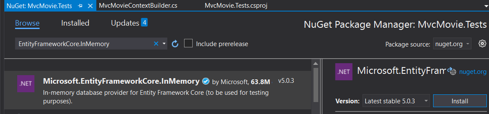
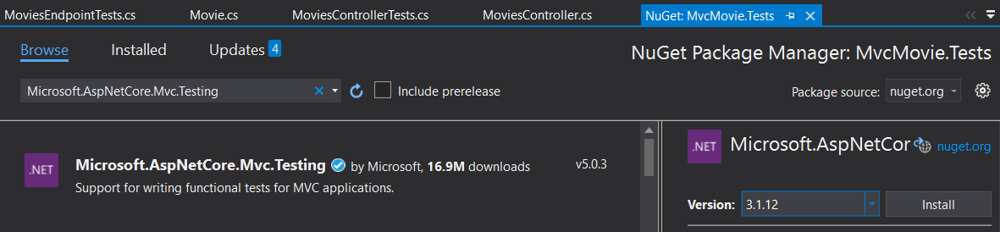

# Lab 3. Añadir tests de integración

En este Lab vamos a ver cómo añadir tests de integración a la aplicación de ejemplo asp.net core mvc utilizando el proveedor de Entity Framework _In Memory_

Vamos a utilizar dos enfoques, primero vamos a realizar pruebas de integración sin levantar la web y posteriormente usaremos la clase **WebApplicationFactory** para levantar un servidor web en memoria y atacar a los endpoints de nuestra web usando **HttpClient**

# Paso 0. Añadir el paquete de EntityFrameworkCore.InMemory

Lo primero que vamos a hacer va a ser añadir el paquete nuget **Microsoft.EntityFrameworkCore.InMemory** en nuestro proyecto **MvcMovie.Tests**



# Paso 1. Crear tests para el método Index

Vamos a empezar añadiendo tests para el métod **Index** del controlador **MoviesController**. primero vamos a comprobar que cuando llamamos al método Index y la base de datos no contiene películas, el controlador nos devuelve una vista con un ViewModel de tipo **MovieGenreViewModel** sin películas.

Para ello, vamos a crear una carpeta llamada **IntegrationTests** dentro del proyecto **MvcMovie.Tests** y allí vamos a crear una clase nueva, **MoviesControllerTests**:

````csharp
    public class MoviesControllerTests
    {
        [Fact]
        public async Task Should_Return_No_Movies_On_Index_Method_When_No_Movies_In_Database()
        {
        }

    }
````

En el cuerpo de este test vamos a:
- Crear una instancia del contexto de base de datos de Entity Framework usando EntityFrameworkCore.InMemory.
- Crear una instancia de la clase **MoviesRepository** pasándole en el constructor el contexto que acabamos de crear.
- Crear una instancia de la clase **MoviesService** pasándole en el constructor la clase repositorio que acabamos de crear.
- Crear una instancia de la clase **MoviesController** pasándole en el constructor la clase servicio que acabamos de crear.
- Llamar al método **Index** de la clase **MoviesController** pasándole dos cadenas vacías como parámetros.
- Recoger el resultado y validar:
    -   Que sea de tipo ViewResult
    -   Que el modelo que devuelve sea de tipo **MovieGenreViewModel**
    -   Que el modelo no tenga películas.

Para crear el contexto de base de datos, como requiere de algunas líneas de código que realmente no aportan nada al test, vamos a utilizar el patrón [**Builder**](https://en.wikipedia.org/wiki/Builder_pattern). Para ello, vamos a crear una carpeta llamada **Configuration** en el proyecto de tests y allí vamos a crear una clase llamada **MvcMovieContextBuilder**

````csharp    
public class MvcMovieContextBuilder
    {
        
    }    
````

dentro de la clase vamos a crear dos propiedades privadas que nos servirán para crear el contexto de EF:

````csharp
        private MvcMovieContext context;
        private DbContextOptionsBuilder<MvcMovieContext> optionsBuilder;
````

Si te fijas, la segunda propiedad es también un Builder de la clase **DbContextOptions**. Utilizaremos el builder para indicar que queremos utilizar el proveedor de EF In Memory.

vamos a añadir el constructor para la clase, en el que instanciaremos la propiedad optionsBuilder.

````csharp
        public MvcMovieContextBuilder()
        {
            optionsBuilder = new DbContextOptionsBuilder<MvcMovieContext>();        
        }
````

Ahora vamos a escribir un método en la clase para indicarle que queremos utilizar el proveedor **In Memory**:

````csharp
        public MvcMovieContextBuilder WithInMemoryProvider()
        {
            optionsBuilder.UseInMemoryDatabase("TestingDB");
            return this;
        }
````

Fíjate de nuevo en este método, el valor de retorno es de tipo **MvcMovieContextBuilder** en la firma del método,  y retornamos la palabra reservada **this**, quiero decir que estamos retornando la misma instancia del objeto MvcMovieContextBuilder. Es la forma de trabajar con este patrón, y así podríamos ir encadenando diferentes configuraciones para nuestro contexto de EF.

Si quieres ver otro ejemplo de cómo funciona el patrón builder, no tienes que buscar muy lejos, en la misma clase Program.cs del proyecto de Asp.Net Core MVC del ejemplo el motor de Asp.NET core MVC lo está utilizando:

````csharp
  public static IWebHostBuilder CreateWebHostBuilder(string[] args) =>
            WebHost.CreateDefaultBuilder(args)
                .UseStartup<Startup>();
````

volviendo al Builder que estamos construyendo, ya solo nos quedaría disponibilizar el contexto de EF para los consumidores del Builder, para ello vamos a crearnos una propiedad llamada **Context** de tipo **MvcMovieContext** dentro del Builder:

````csharp
        public MvcMovieContext Context
        {
            get
            {
                context = new MvcMovieContext(optionsBuilder.Options);
                context.Database.EnsureDeleted();
                context.Database.EnsureCreated();                                
                return context;
            }
        }
````
Ojo, es muy importante que cuando instanciamos el context MvcMovieContext llamemos a los métodos EnsureDeleted y EnsureCreated, sobre todo porque si tenemos varios tests que utilizan entity framework en memoria y no eliminamos la base de datos cada vez que creamos la base de datos podríamos tener resultados inesperados en los tests.

Y con esto ya lo tendríamos! el código completo del builder por si lo quieres comparar con el tuyo es este:

````csharp
 public class MvcMovieContextBuilder
    {
        private MvcMovieContext context;
        private DbContextOptionsBuilder<MvcMovieContext> optionsBuilder;
        public MvcMovieContextBuilder()
        {
            optionsBuilder = new DbContextOptionsBuilder<MvcMovieContext>();
        }
        
        public MvcMovieContextBuilder WithInMemoryProvider()
        {
            optionsBuilder.UseInMemoryDatabase("TestingDB");
            return this;
        }

        public MvcMovieContext Context
        {
            get
            {
                context = new MvcMovieContext(optionsBuilder.Options);
                context.Database.EnsureCreated();
                return context;
            }
        }
    }
````
Ahora que ya tenemos el builder definido, vamos a volver a nuestro test de integración, si recuerdas, los pasos que teníamos que hacer eran:

- Crear una instancia del contexto de base de datos (usando el builder que acabamos de crear).
- Crear una instancia de la clase **MoviesRepository** pasándole en el constructor el contexto que acabamos de crear.
- Crear una instancia de la clase **MoviesService** pasándole en el constructor la clase repositorio que acabamos de crear.
- Crear una instancia de la clase **MoviesController** pasándole en el constructor la clase servicio que acabamos de crear.
- Llamar al método **Index** de la clase **MoviesController** pasándole dos cadenas vacías como parámetros.
- Recoger el resultado y validar:
    -   Que sea de tipo ViewResult
    -   Que el modelo que devuelve sea de tipo **MovieGenreViewModel**
    -   Que el modelo no tenga películas.


Escribe tu mismo el test, y si te atascas, esta sería una posible solución:

````csharp
        const int ZERO_MOVIES = 0;        
        [Fact]
        public async Task Should_Return_No_Movies_On_Index_Method_When_No_Movies_In_Database()
        {
            // Arrange
            MvcMovieContext context = new MvcMovieContextBuilder()
                                        .WithInMemoryProvider()                                       
                                        .Context;
            MoviesRepository repository = new MoviesRepository(context);
            MoviesService service = new MoviesService(repository);
            MoviesController systemUnderTest = new MoviesController(service);

            // Act
            IActionResult result = await systemUnderTest.Index(string.Empty, string.Empty);

            // Assert
            Assert.True(result is ViewResult);
            Assert.True(((ViewResult)result).Model is MovieGenreViewModel);
            MovieGenreViewModel model = ((ViewResult)result).Model as MovieGenreViewModel;
            Assert.Equal(model.Movies.Count, ZERO_MOVIES);            
        }
````

# Paso 2. Crear un test para el método Create

Ahora vamos a añadir un test para confirmar que cuando llamamos al método Create pasándole una película, ésta se graba correctamente en la base de datos. Te paso la firma del test:

````csharp
        [Fact]
        public async Task Should_Create_Movie_In_Database_On_Create()
        {

        }
````

Este test debería:

- Crear una instancia del contexto de base de datos (usando el builder).
- Crear una instancia de la clase **MoviesRepository** pasándole en el constructor el contexto que acabamos de crear.
- Crear una instancia de la clase **MoviesService** pasándole en el constructor la clase repositorio que acabamos de crear.
- Crear una instancia de la clase **MoviesController** pasándole en el constructor la clase servicio que acabamos de crear.
- Crear una instancia de **Movie** y rellenar sus campos.
- Llamar al método **Create** de la clase **MoviesController** pasándole la instancia de **Movie** que acabamos de crear.
- Obtener las películas de la base de datos usando la propiedad **Movie** del contexto (solo debería haber una película, la que acabamos de crear!)
- Comprobar que el título de la película que acabamos de obtener de base de datos es el mismo que la película que hemos creado en el punto 5 de esta lista.

Escribe tu mismo el test, y si te atascas, esta sería una posible [solución](soluciones.md#paso-2-crear-un-test-para-el-m%C3%A9todo-create):

# Paso 3. Utilizar WebApplicationFactory

Ahora que ya sabemos cómo ejecutar tests de integración sin levantar un servidor web, vamos a ver cómo utilizar la clase WebApplicationBuilder para ejecutar un servidor web en memoria y realizar tests de integración usandolo.

Para poder utilizar la clase WebApplicationFactory en nuestros tests es necesario instalar el paquete nuget **Microsoft.AspNetCore.Mvc.Testing**



Vamos a añadir una clase nueva en la carpeta de IntegrationTests y la vamos a llamar **MoviesPageTests**

````csharp
    public class MoviesPageTests
    {              
    }
````

Para probar, vamos a crear un test muy sencillo que realice un Get sobre el método Index y que compruebe que el resultado es un código Http 200:

````csharp
        [Fact]
        public async Task Should_Call_Index_Ok()
        {
            // Arrange
            WebApplicationFactory<Startup> factory =
                        new Microsoft.AspNetCore.Mvc.Testing.WebApplicationFactory<Startup>();
            var client = factory.CreateClient();
            var expected = System.Net.HttpStatusCode.OK;

            // Act
            var response = await client.GetAsync("movies/");
            response.EnsureSuccessStatusCode();
            
            // Assert
            Assert.NotNull(response);
            Assert.Equal(response.StatusCode, expected);
        }
````

Si ejecutas este test, verás que funciona, pero hay un par de cosas que no están bien.

- Estamos creando una instancia del objeto WebApplicationFactory dentro del test, esto normalmente no está del todo mal, pero según la documentación de Microsoft si nuestra intención es reutilizar la instancia de WebApplicationFactory en varios tests dentro de la misma clase, deberíamos implementar la clase de test con la interfaz IClassFixture de esta forma:

````csharp
    public class MoviesPageTests:IClassFixture<WebApplicationFactory<Startup>>
    {
        private readonly WebApplicationFactory<Startup> factory;
        public MoviesPageTests(WebApplicationFactory<Startup> _factory)
        {
            factory = _factory;
        }
        [Fact]
        public async Task Should_Call_Index_Ok()
        {
            // Arrange            
            var client = factory.CreateClient();
            var expected = System.Net.HttpStatusCode.OK;

            // Act
            var response = await client.GetAsync("movies/");
            response.EnsureSuccessStatusCode();
            
            // Assert
            Assert.NotNull(response);
            Assert.Equal(response.StatusCode, expected);
        }
    }
````

Y la segunda parte que no está bien (de hecho es la peor!!) es que como estamos indicando que WebApplicationFactory utiliza como clase de entrada la clase Startup de nuestro proyecto de Asp.Net Core MVC, no estamos utilizando Entity Framework In Memory, sino que estamos utilizando la misma base de datos que usa la web para nuestras pruebas. Esto nunca debería hacerse así.

Si nos fijamos en la documentación que tiene Microsoft sobre los [Test de Integración](https://docs.microsoft.com/en-us/aspnet/core/test/integration-tests?view=aspnetcore-5.0) vemos que para poder utilizar Entity Framework In Memory debemos _customizar_ la clase WebApplicationfactory, así que vamos a crear dentro de la carpeta **Configuration** de nuesgro proyecto de tests una clase llamada **CustomWebApplicationFactory** (te paso el fichero completo con la sección de using):

````csharp
using Microsoft.AspNetCore.Hosting;
using Microsoft.AspNetCore.Mvc.Testing;
using Microsoft.Extensions.Logging;
using MvcMovie.Models;
using Microsoft.Extensions.DependencyInjection;
using Microsoft.EntityFrameworkCore;
using System.Linq;

namespace MvcMovie.Tests.Configuration
{
    public class CustomWebApplicationFactory<TStartup>
        : WebApplicationFactory<TStartup> where TStartup : class
    {
        protected override void ConfigureWebHost(IWebHostBuilder builder)
        {
            builder.ConfigureServices(services =>
            {
                var descriptor = services.SingleOrDefault(
                    d => d.ServiceType ==
                        typeof(DbContextOptions<MvcMovieContext>));

                services.Remove(descriptor);

                services.AddDbContext<MvcMovieContext>(options =>
                {
                    options.UseInMemoryDatabase("InMemoryDbForTesting");
                });

                var sp = services.BuildServiceProvider();

                using (var scope = sp.CreateScope())
                {
                    var scopedServices = scope.ServiceProvider;
                    var db = scopedServices.GetRequiredService<MvcMovieContext>();
                    var logger = scopedServices
                        .GetRequiredService<ILogger<CustomWebApplicationFactory<TStartup>>>();
                    
                    db.Database.EnsureDeleted();
                    db.Database.EnsureCreated();                    
                }
            });
        }
    }
}

````

Una vez hecho esto, solo tendríamos que cambiar nuestro WebApplicationFactory en nuestro test por lo siguiente:

````csharp
public class MoviesPageTests:IClassFixture<CustomWebApplicationFactory<Startup>>
    {
        private readonly CustomWebApplicationFactory<Startup> factory;
        public MoviesPageTests(CustomWebApplicationFactory<Startup> _factory)
        {
            factory = _factory;
        }
        [Fact]
        public async Task Should_Call_Index_Ok()
        {
            // Arrange            
            var client = factory.CreateClient();
            
            // Act
            var response = await client.GetAsync("movies/");
            response.EnsureSuccessStatusCode();
            
            // Assert
            Assert.NotNull(response);
        }
    }
````

Con esto conseguiríamos levantar un TestServer que utiliza una base de datos en memoria para nuestras pruebas de integración.

# Paso 4. Rellenar de forma dinámica la base de datos para nuestros tests.

Vale,ya conseguimos utilizar Entity Framework In Memory usando nuestro servidor de tests en memoria con WebApplicationFactory, pero cómo podemos alimentar la base de datos con datos de prueba para nuestros tests, y que sean dinámicos para poder testear diferentes escenarios según las necesidades?

Bueno, en este mismo Lab hemos visto como trabajar con el patrón **Builder** y si nos fijamos un poco, la clase **WebApplicationFactory** utiliza ese mismo patrón para levantar el servidor web de tests, así que podríamos utilizar una aproximación similar a lo que hicimos para nuestra clase **MvcMovieContextBuilder**; Vamos a abrir la clase **CustomWebApplicationFactory** y a crear una propiedad privada:

````csharp
private List<Movie> movies;
````

y dentro de la misma clase, vamos a crear este método, similar al que creamos en la clase **MvcMovieContextBuilder**:

````csharp
        public CustomWebApplicationFactory<TStartup> WithMoviesInDatabase(List<Movie> _movies)
        {
            if (movies == null)
                movies = new List<Movie>();

            movies.AddRange(_movies);
            return this;
        }
````

ahora vamos a centrarnos en el método **ConfigureWebHost**, tenemos que alimentar la base de datos justo después de que se llame a la instrucción **EnsureCreated()**:

````csharp
                    if(movies != null && movies.Any())
                    {
                        db.Movie.AddRange(movies);
                        db.SaveChanges();
                    }
````

te paso el código completo de la clase CustomWebApplicationFactory:

````csharp
    public class CustomWebApplicationFactory<TStartup>
        : WebApplicationFactory<TStartup> where TStartup : class
    {
        private List<Movie> movies;

        public CustomWebApplicationFactory<TStartup> WithMoviesInDatabase(List<Movie> _movies)
        {
            if (movies == null)
                movies = new List<Movie>();

            movies.AddRange(_movies);
            return this;
        }

        protected override void ConfigureWebHost(IWebHostBuilder builder)
        {
            builder.ConfigureServices(services =>
            {
                var descriptor = services.SingleOrDefault(
                    d => d.ServiceType ==
                        typeof(DbContextOptions<MvcMovieContext>));

                services.Remove(descriptor);

                services.AddDbContext<MvcMovieContext>(options =>
                {
                    options.UseInMemoryDatabase("InMemoryDbForTesting");
                });

                var sp = services.BuildServiceProvider();

                using (var scope = sp.CreateScope())
                {
                    var scopedServices = scope.ServiceProvider;
                    var db = scopedServices.GetRequiredService<MvcMovieContext>();
                    var logger = scopedServices
                        .GetRequiredService<ILogger<CustomWebApplicationFactory<TStartup>>>();
                    
                    db.Database.EnsureDeleted();
                    db.Database.EnsureCreated();   
                    
                    if(movies != null && movies.Any())
                    {
                        db.Movie.AddRange(movies);
                        db.SaveChanges();
                    }
                }
            });
        }
    }
````

Vamos a escribir un test que compruebe que cuando llamamos al método Index del endpoint de movies cuando nuestra base de datos está cargada obtenemos las películas que están cargadas en la base de datos, usando el método **WithMoviesInDatabase** que hemos creado en nuestra clase **CustomWebApplicationFactory**:

````csharp
        [Fact]
        public async Task Should_Return_Movies_On_Index_With_Movies_In_Database()
        {
            // Arrange    
            var terminatorMovie = new Movie() { Title = "Terminator 2", Genre = "Action" };
            var movies = new List<Movie>() { terminatorMovie };
            var client = factory
                .WithMoviesInDatabase(movies)
                .CreateClient();

            var expected = System.Net.HttpStatusCode.OK;

            // Act
            var response = await client.GetAsync("movies");
            response.EnsureSuccessStatusCode();
            
            string content = await response.Content.ReadAsStringAsync();


            // Assert
            Assert.NotNull(response);
            Assert.Equal(response.StatusCode, expected);
            Assert.Contains(terminatorMovie.Title, content);
        }
````

# Paso 5. Probar métodos que usen AntiforgeryToken

En Asp.Net Core MVC existe un mecanismo para prevenir los ataques [Cross-Site Request Forgery](https://docs.microsoft.com/en-us/aspnet/core/security/anti-request-forgery?view=aspnetcore-5.0). Esto impacta contra nuestros tests de integración, ya que tenemos que simular que efectivamente estamos visitando el site cuando ejecutamos un post contra el servidor de test y así salvar esta validación.

Normalmente, el Antiforgery Token se envía cuando hacemos una solicitud al servidor tanto en las Cookies de las cabeceras de la solicitud como en el cuerpo de la solicitud (si estamos enviando un Post/Put).

Vamos a ver un ejemplo con esta misma Web, escribiendo un test que se encargue de crear una película en la base de datos utilizando la página **Create**. Para poder ejecutar correctamente el test deberemos:

- Realizar una solicitud **GET** a la página **Create** (simulando que estamos visitando la página).
- Recuperar del cuerpo de la respuesta el campo hidden que guarda el valor del antiforgerytoken
- Recuperar de las cookies de la respuesta la cookie con el antiforgerytoken
- Construir una solicitud Http que contenga en el cuerpo de la solicitud la película que vamos a crear en la base de datos y el antiforgerytoken
- Incluir en las cabeceras de la solicitud http una cookie con el antiforgerytoken.

Para ello vamos a seguir este ejemplo que tienen publicado desde la web de [codemaze](https://code-maze.com/testing-anti-forgery-token-asp-net-core-mvc/).

Lo primero que vamos a crear va a ser una clase que encapsule la lógica de recuperación del antiforgerytoken, dentro de la carpeta **Configuration**:

````csharp
public static class AntiForgeryTokenExtractor
    {
        public static string AntiForgeryFieldName { get; } = "AntiForgeryTokenField";
        public static string AntiForgeryCookieName { get; } = "AntiForgeryTokenCookie";

        private static string ExtractAntiForgeryCookieValueFrom(HttpResponseMessage response)
        {
            string antiForgeryCookie = response.Headers.GetValues("Set-Cookie")
                .FirstOrDefault(x => x.Contains(AntiForgeryCookieName));
            if (antiForgeryCookie is null)
            {
                throw new ArgumentException($"Cookie '{AntiForgeryCookieName}' not found in HTTP response", nameof(response));
            }
            string antiForgeryCookieValue = SetCookieHeaderValue.Parse(antiForgeryCookie).Value.ToString();
            return antiForgeryCookieValue;
        }

        private static string ExtractAntiForgeryToken(string htmlBody)
        {
            var requestVerificationTokenMatch = Regex.Match(htmlBody, $@"\<input name=""{AntiForgeryFieldName}"" type=""hidden"" value=""([^""]+)"" \/\>");
            if (requestVerificationTokenMatch.Success)
            {
                return requestVerificationTokenMatch.Groups[1].Captures[0].Value;
            }
            throw new ArgumentException($"Anti forgery token '{AntiForgeryFieldName}' not found in HTML", nameof(htmlBody));
        }

        public static async Task<(string fieldValue, string cookieValue)> ExtractAntiForgeryValues(HttpResponseMessage response)
        {
            var cookie = ExtractAntiForgeryCookieValueFrom(response);
            var token = ExtractAntiForgeryToken(await response.Content.ReadAsStringAsync());
            return (token, cookie);
        }
    }
````

Después, vamos a configurar nuestra clase **CustomWebApplicationFactory** para que en el método **ConfigureServices** configure el antiforgerytoken llamando al input del formulario y a la cookie con el valor que tenemos definido en nuestro **AntiForgeryTokenExtractor**:

````csharp
                services.AddAntiforgery(t =>
                {
                    t.Cookie.Name = AntiForgeryTokenExtractor.AntiForgeryCookieName;
                    t.FormFieldName = AntiForgeryTokenExtractor.AntiForgeryFieldName;
                });

````

te paso el código de la clase completa:

````csharp
public class CustomWebApplicationFactory<TStartup>
        : WebApplicationFactory<TStartup> where TStartup : class
    {
        private List<Movie> movies;

        public CustomWebApplicationFactory<TStartup> WithMoviesInDatabase(List<Movie> _movies)
        {
            if (movies == null)
                movies = new List<Movie>();

            movies.AddRange(_movies);
            return this;
        }

        protected override void ConfigureWebHost(IWebHostBuilder builder)
        {
            builder.ConfigureServices(services =>
            {
                var descriptor = services.SingleOrDefault(
                    d => d.ServiceType ==
                        typeof(DbContextOptions<MvcMovieContext>));

                services.Remove(descriptor);

                services.AddDbContext<MvcMovieContext>(options =>
                {
                    options.UseInMemoryDatabase("InMemoryDbForTesting");
                });

                services.AddAntiforgery(t =>
                {
                    t.Cookie.Name = AntiForgeryTokenExtractor.AntiForgeryCookieName;
                    t.FormFieldName = AntiForgeryTokenExtractor.AntiForgeryFieldName;
                });

                var sp = services.BuildServiceProvider();

                using (var scope = sp.CreateScope())
                {
                    var scopedServices = scope.ServiceProvider;
                    var db = scopedServices.GetRequiredService<MvcMovieContext>();
                    var logger = scopedServices
                        .GetRequiredService<ILogger<CustomWebApplicationFactory<TStartup>>>();
                    
                    db.Database.EnsureDeleted();
                    db.Database.EnsureCreated();   
                    
                    if(movies != null && movies.Any())
                    {
                        db.Movie.AddRange(movies);
                        db.SaveChanges();
                    }
                }
            });
        }
    }
````

Ahora que ya tenemos nuestro CustomWebApplicationFactory configurado con el antiforgery, podemos escribir el test, que sería algo así:

````csharp
        [Fact]
        public async Task Should_Create_Movie_On_Create_Page()
        {
            // Arrange    
            var terminatorMovie = new Movie() { Title = "Terminator 2", Genre = "Action" };           
            var client = factory                
                .CreateClient();

            var expected = System.Net.HttpStatusCode.OK;
            var response = await client.GetAsync("movies/create");
            response.EnsureSuccessStatusCode();
            var (fieldValue, cookieValue) = await AntiForgeryTokenExtractor.ExtractAntiForgeryValues(response);

            var postRequest = new HttpRequestMessage(HttpMethod.Post, "movies/create");
            postRequest.Headers.Add("Cookie",
                new CookieHeaderValue(AntiForgeryTokenExtractor.AntiForgeryCookieName,
                                    cookieValue).ToString());

            var formModel = new Dictionary<string, string>
            {
                { AntiForgeryTokenExtractor.AntiForgeryFieldName, fieldValue },
                { nameof(terminatorMovie.Title), terminatorMovie.Title },
                { nameof(terminatorMovie.Genre), terminatorMovie.Genre },
                { nameof(terminatorMovie.Price), terminatorMovie.Price.ToString() },
                { nameof(terminatorMovie.ReleaseDate), terminatorMovie.ReleaseDate.ToString() },
            };
            postRequest.Content = new FormUrlEncodedContent(formModel);


            // Act
            response = await client.SendAsync(postRequest);
            response.EnsureSuccessStatusCode();
            string content = await response.Content.ReadAsStringAsync();

            // Assert
            Assert.NotNull(response);
            Assert.Equal(response.StatusCode, expected);
            Assert.Contains(terminatorMovie.Title, content);
        }
````
vamos a ver los pasos importantes que realiza este test uno a uno:

- Realizar una solicitud **GET** a la página **Create** (simulando que estamos visitando la página).
````csharp
var response = await client.GetAsync("movies/create");
            response.EnsureSuccessStatusCode();
````
- Recuperar del cuerpo de la respuesta el campo hidden que guarda el valor del antiforgerytoken
- Recuperar de las cookies de la respuesta la cookie con el antiforgerytoken
````csharp
var (fieldValue, cookieValue) = await AntiForgeryTokenExtractor.ExtractAntiForgeryValues(response);
````
- Construir una solicitud Http que contenga en el cuerpo de la solicitud la película que vamos a crear en la base de datos y el antiforgerytoken
- Incluir en las cabeceras de la solicitud http una cookie con el antiforgerytoken.
````csharp
var postRequest = new HttpRequestMessage(HttpMethod.Post, "movies/create");
            postRequest.Headers.Add("Cookie",
                new CookieHeaderValue(AntiForgeryTokenExtractor.AntiForgeryCookieName,
                                    cookieValue).ToString());

            var formModel = new Dictionary<string, string>
            {
                { AntiForgeryTokenExtractor.AntiForgeryFieldName, fieldValue },
                { nameof(terminatorMovie.Title), terminatorMovie.Title },
                { nameof(terminatorMovie.Genre), terminatorMovie.Genre },
                { nameof(terminatorMovie.Price), terminatorMovie.Price.ToString() },
                { nameof(terminatorMovie.ReleaseDate), terminatorMovie.ReleaseDate.ToString() },
            };
            postRequest.Content = new FormUrlEncodedContent(formModel);
````

## Ejercicio. Escribir un test para la edición de una película

Con lo que has aprendido en los dos últimos pasos, crea un test de integración para el método edit, confirmando que puedes editar el título de una película correctamente.

Si te atascas o te encuentras algún problema, aquí tienes una posible [solución](soluciones.md#escribir-un-test-para-la-edici%C3%B3n-de-una-pel%C3%ADcula)
