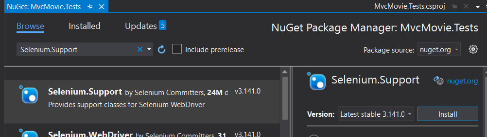
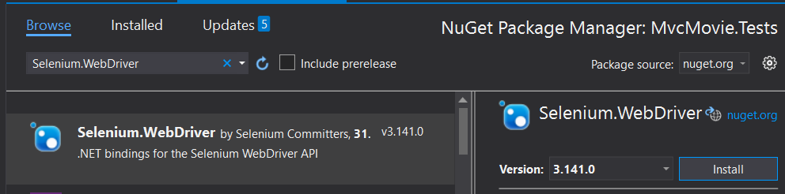

# Lab 4. Introducción a los tests de UI con Selenium

En este Lab vamos a ver como incorporar tests de UI en un proyecto de Asp.NET Core MVC utilizando la librería de Selenium.

Para ello vamos a utilizar el mismo proyecto de prueba de Asp.NET Core MVC que hemos usado en los labs anteriores.

Selenium es una librería que se encarga de ejecutar una instancia de un navegador web y realizar los pasos que le vayamos indicando en código. No solo se utiliza para ejecutar tests automáticos de aplicaciones, pero es una herramienta ideal para este propósito.

# Paso 0. Instalar Selenium

Para poder ejecutar Selenium en nuestra máquina tenemos que instalar varias cosas:

- Los paquetes Nuget de Selenium en nuestro proyecto de test.
- Selenium Standalone en nuestro equipo, para ejecutar selenium de forma independiente (necesitas tener npm instalado)

Vamos a instalar los paquetes nuget de Selenium: **Selenium.WebDriver** y **Selenium.Support**





Después, utilizando npm, vamos a descargar y a ejecutar selenium standalone (desde el terminal):

````bash
npm install -g selenium-standalone@latest
selenium-standalone install
````

# Paso 1. Crear un Custom WebApplicationFactory para Selenium

Necesitamos poder levantar el ejecutable de selenium cuando arranquemos nuestros tests de UI, para ello vamos a customizar nuestra clase CustomWebApplicationFactory creando una nueva clase dentro de la carpeta **Configuration** que se llame **SeleniumServerFactory** y que herede de nuestro **CustomWebApplicationFactory**:

````csharp
public class SeleniumServerFactory<TStartup> : CustomWebApplicationFactory<TStartup> where TStartup : class
    {
        public string RootUri { get; set; } //Save this use by tests

        Process _process;
        IWebHost _host;

        public SeleniumServerFactory()
        {
            ClientOptions.BaseAddress = new Uri("https://localhost"); //will follow redirects by default

            _process = new Process()
            {
                StartInfo = new ProcessStartInfo
                {
                    FileName = "selenium-standalone",
                    Arguments = "start",
                    UseShellExecute = true
                }
            };
            _process.Start();
        }

        protected override TestServer CreateServer(IWebHostBuilder builder)
        {
            //Real TCP port
            _host = builder.Build();
            _host.Start();
            RootUri = _host.ServerFeatures.Get<IServerAddressesFeature>().Addresses.LastOrDefault(); //Last is https://localhost:5001!

            //Fake Server we won't use...this is lame. Should be cleaner, or a utility class
            return new TestServer(new WebHostBuilder().UseStartup<TStartup>());
        }

        protected override void Dispose(bool disposing)
        {
            base.Dispose(disposing);
            if (disposing)
            {
                _host.Dispose();
                _process.CloseMainWindow(); //Be sure to stop Selenium Standalone
            }
        }
    }
````

Si te fijas en el constructor de esta nueva clase:

````csharp
        public SeleniumServerFactory()
        {
            ClientOptions.BaseAddress = new Uri("https://localhost"); //will follow redirects by default

            _process = new Process()
            {
                StartInfo = new ProcessStartInfo
                {
                    FileName = "selenium-standalone",
                    Arguments = "start",
                    UseShellExecute = true
                }
            };
            _process.Start();
        }
````

Lo que estamos haciendo es arrancar un nuevo proceso con selenium-standalone (que hemos instalado previamente).

Y en el método dispose:

````csharp
protected override void Dispose(bool disposing)
        {
            base.Dispose(disposing);
            if (disposing)
            {
                _host.Dispose();
                _process.CloseMainWindow(); //Be sure to stop Selenium Standalone
            }
        }
````

Nos aseguramos de parar el proceso de Selenium.

También es importante, como tenemos varios tests que levantan un test server en memoria, que decoremos las clases que utilicen un test server con el atributo **Collection** para que xUnit se encargue de ejecutar los tests de cada clase **uno a uno** en vez de en paralelo, y así evitar colisiones, con lo que marcaremos las clases **SeleniumTests** y **MoviesPageTests** con el siguiente decorador:

````csharp
    [Collection("Secuential Integration Tests")]
    public class MoviesPageTests:IClassFixture<CustomWebApplicationFactory<Startup>>
````

````csharp
    [Collection("Secuential Integration Tests")]
    public class SeleniumTests : IClassFixture<SeleniumServerFactory<Startup>>, IDisposable
````

# Paso 2. Crear nuestro primer test de UI

Ahora que ya tenemos nuestro Test server configurado para que arranque Selenium, podemos centrarnos en escribir nuestro primer test. Para ello vamos a crear una nueva clase que vamos a llamar **SeleniumTests** dentro de la carpeta de **IntegrationTests**:

````csharp
public class SeleniumTests : IClassFixture<SeleniumServerFactory<Startup>>, IDisposable
    {
        public SeleniumServerFactory<Startup> Server;
        public IWebDriver Browser;
        public HttpClient Client;        

        public SeleniumTests(SeleniumServerFactory<Startup> server)
        {
            Server = server;
            Client = Server.CreateClient()                                        
            var opts = new ChromeOptions();
            opts.AddArgument("--headless");
            opts.SetLoggingPreference(OpenQA.Selenium.LogType.Browser, LogLevel.All);

            var driver = new RemoteWebDriver(opts);
            Browser = driver;            
        }


        public void Dispose()
        {
            Browser.Dispose();
            Client.Dispose();
        }
    }
````

Esta clase tiene algunas cosas diferentes de las otras clases para los tests de integración:

- Define una propiedad IWebDriver que es la que se encargará de interactuar con el navegador
- Definimos el HttpClient a nivel global y lo instanciamos desde el constructor de la clase en vez de instanciarlo localmente en cada test, para que su ciclo de vida vaya ligado al objeto anterior que maneja el navegador.
- Definimos una serie de propiedades para el Web Driver de Selenium y se la pasamos a su constructor, en la línea:
````csharp
opts.AddArgument("--headless");
````
estamos indicando que no queremos que se abra una nueva ventana del navegador cuando ejecutamos los tests, si quieres, cuando terminemos de crear el primer test, prueba a comentar esta línea y a lanzar los test.
- Por último, esta clase implementa la interfaz IDisposable, para asegurarse de que se llama al método Dispose del objeto que maneja el navegador y del objeto que levanta el servidor de test a la vez.

Para este primer test vamos a probar algo muy sencillo, vamos a cargar la página raíz de nuestra web y vamos a comprobar que el título es el que esperamos:

````csharp
        [Fact]
        public void Should_Display_Title_In_Main_Page()
        {  
            // Act       
            Browser.Navigate().GoToUrl(Server.RootUri);

            // Assert
            Assert.Equal("Home Page - Movie App", Browser.Title);            
        }
````
Primero nos posicionamos en la página raíz de la web con la instrucción **Browser.Navigate().GoToUrl(Server.RootUri);**

Y luego comprobamos que el título de la página es el que esperamos, accediendo a la propiedad Title del objeto IWebDriver

Prueba a comentar la línea que hemos visto antes en el constructor de la clase para ver cómo se levanta una nueva ventana del navegador al ejecutar el test.

# Paso 3. Trabajar con los controles de Selenium

Ahora vamos a ver cómo trabajar con los controles de Selenium y obtener elementos del formulario, pero antes vamos a modificar nuestro servidor de test para que arranque con algunas películas en la base de datos.

Para ello vamos a crear un método privado dentro de la clase de tests:

````csharp
private List<Movie> GetMovies()
        {
            return new List<Movie>() {
                    new Movie
                    {
                        Title = "When Harry Met Sally",
                        ReleaseDate = DateTime.Parse("1989-2-12"),
                        Genre = "Romantic Comedy",
                        Price = 7.99M
                    },
                    new Movie
                    {
                        Title = "Ghostbusters ",
                        ReleaseDate = DateTime.Parse("1984-3-13"),
                        Genre = "Comedy",
                        Price = 8.99M
                    },
                    new Movie
                    {
                        Title = "Ghostbusters 2",
                        ReleaseDate = DateTime.Parse("1986-2-23"),
                        Genre = "Comedy",
                        Price = 9.99M
                    },
                    new Movie
                    {
                        Title = "Rio Bravo",
                        ReleaseDate = DateTime.Parse("1959-4-15"),
                        Genre = "Western",
                        Price = 3.99M
                    }};
        }
````

Y vamos a añadir una línea en nuestro SeleniumServerFactory, aprovechando la función que creamos en el lab anterior:

````csharp
            Client = Server                    
                    .WithMoviesInDatabase(GetMovies())
                    .CreateClient(); 
````

El constructor quedaría así:

````csharp
        public SeleniumTests(SeleniumServerFactory<Startup> server)
        {
            Server = server;
            Client = Server                    
                    .WithMoviesInDatabase(GetMovies())
                    .CreateClient();            
            var opts = new ChromeOptions();
            opts.AddArgument("--headless");
            opts.SetLoggingPreference(OpenQA.Selenium.LogType.Browser, LogLevel.All);

            var driver = new RemoteWebDriver(opts);
            Browser = driver;            
        }
````

Ahora que tenemos el servidor de test con un juego de películas cargado en nuestra base de datos en memoria, vamos a escribir un test que:

- Navegue a la url /movies.
- Recupere el listado de películas de la página HTML.
- Compruebe que todas las películas que hemos cargado en la base de datos se encuentran en el listado que muestra la página

Si echamos un vistazo a la vista que carga las películas (/Views/Movies/Index.cshtml) podemos ver que la página se renderiza de esta forma:

````html
<table class="table">
    <thead>
        <tr>
            <th>
                @Html.DisplayNameFor(model => model.Movies[0].Title)
            </th>
            <th>
                @Html.DisplayNameFor(model => model.Movies[0].ReleaseDate)
            </th>
            <th>
                @Html.DisplayNameFor(model => model.Movies[0].Genre)
            </th>
            <th>
                @Html.DisplayNameFor(model => model.Movies[0].Price)
            </th>
            <th></th>
        </tr>
    </thead>
    <tbody>
        @foreach (var item in Model.Movies)
        {
            <tr>
                <td>
                    @Html.DisplayFor(modelItem => item.Title)
                </td>
                <td>
                    @Html.DisplayFor(modelItem => item.ReleaseDate)
                </td>
                <td>
                    @Html.DisplayFor(modelItem => item.Genre)
                </td>
                <td>
                    @Html.DisplayFor(modelItem => item.Price)
                </td>
                <td>
                    <a asp-action="Edit" asp-route-id="@item.Id">Edit</a> |
                    <a asp-action="Details" asp-route-id="@item.Id">Details</a> |
                    <a asp-action="Delete" asp-route-id="@item.Id">Delete</a>
                </td>
            </tr>
        }
    </tbody>
</table>
````

Selenium nos permite obtener elementos usando entre otras cosas selectores CSS, así que vamos a recuperar todos los títulos de todas las películas de la tabla buscando el primer td de cada tr  usando el selector "tbody > tr > td:nth-of-type(1)"

````csharp
        [Fact]
        public void Should_Display_Movies_List_In_Movies_Page()
        {
            // Arrange
            var movies = GetMovies();

            // Act
            Browser.Navigate().GoToUrl($"{Server.RootUri}/movies/Index");
            var movieTitlesRendered = Browser.FindElements(By.CssSelector("tbody > tr > td:nth-of-type(1)"))
                                        .Select(x => x.Text.Trim());

            // Assert            
            foreach (var movie in movies)
            {
                Assert.Contains(movie.Title.Trim(), movieTitlesRendered);
            }                        
        }
````

# Paso 4. Interactuar con los controles del formulario.

Vamos a escribir ahora un test que se encargue de filtrar las películas que se muestran en la página.

Primero vamos a escribir un test que ejecute un filtrado de películas por género y luego compruebe que todos los registros de la tabla devuelta pertenecen al mismo género

### Cómo trabajar con un elemento select desde Selenium

Cuando ejecutamos una consulta **FindElement** Selenium nos devuelve un objeto IWebElement, con lo que tendremos que crear un objeto **SelectElement** pasándole el IWebElement que hemos recuperado de la consulta al driver de Selenium.

Después de eso, podemos elegir el valor del control select utilizando los métodos SelectByText o SelectByValue

### Cómo lanzar el evento click de un botón
Para lanzar el evento click del botón que se encarga de filtrar, debemos recuperar el botón primero con una consulta al driver y después lanzar el evento Click del objeto devuelto por la consulta.


````csharp
        [Fact]
        public void Should_Filter_Movies_By_Genre()
        {
            // Arrange
            var movies = GetMovies();
            var firstGenre = movies.First().Genre;
            int expected = 1;            
            Browser.Navigate().GoToUrl($"{Server.RootUri}/movies/Index");
            SelectElement select = new SelectElement(Browser.FindElement(By.TagName("select")));
            IWebElement filterButton = Browser.FindElement(By.CssSelector("input[type=submit]"));

            // Act
            select.SelectByText(firstGenre);
            filterButton.Click();

            var genresdisplayed = Browser.FindElements(By.CssSelector("tbody > tr > td:nth-of-type(3)"))
                                    .Select(x => x.Text).Distinct();

            // Assert
            Assert.Equal(expected, genresdisplayed.Count());

        }
````

Seguimos con el siguiente test, vamos a comprobar que cuando filtramos por algun título de alguna película solo se debe mostrar en la tabla de resultados un solo registro.

### Cómo introducir texto en un control

Una vez hayamos recuperado el control mediante una consulta al driver de Selenium, utilizaremos el método **SendKeys** para establecer el valor que le queremos asignar al control.

````csharp
        [Fact]
        public void Should_Filter_Movies_By_Title()
        {
            // Arrange
            var movies = GetMovies();
            var firstTitle = movies.First().Title;
            int justOneFilm = 1;
            Browser.Navigate().GoToUrl($"{Server.RootUri}/movies/Index");
            IWebElement filterInput = Browser.FindElement(By.CssSelector("input[type=text]"));
            IWebElement filterButton = Browser.FindElement(By.CssSelector("input[type=submit]"));

            // Act
            filterInput.SendKeys(firstTitle);
            filterButton.Click();
            var elements = Browser.FindElements(By.CssSelector("tbody > tr"));

            // Assert
            Assert.Equal(justOneFilm, elements.Count);
        }
````

# Paso 5. Crear un test para la creación de una película

Con lo que hemos visto en los dos ejemplo anteriores, vamos a crear un test que se encargue de:
- Navegar a la página de "movies/create"
- Recupere todos los inputs de la web
- Limpie los valores previos, ya que el formulario carga valores por defecto
- Asignemos valores a cada control
- Lancemos el evento click del botón de tipo submit del formulario

Una vez hayamos lanzado el evento click, automáticamente la web nos deberá redirigir a la página de index, con lo que para realizar la comprobación recuperaremos todos los títulos de la tabla que renderiza la página Index (como hemos hecho en los ejemplos anteriores) y compruebe que el título de la película que hemos creado se encuentra entre ellos.

Prueba a crear tu el test, y si te atascas o encuentras algún problema, aquí tienes una posible [solución](soluciones.md)

# Paso 6. Refactorizar

Cuando termines el test, si has seguido más o menos el enfoque que proponía yo en la solución, te habrás encontrado con algo similar a esto:

````csharp
 [Fact]
        public void Should_Create_New_Movie()
        {
            // Arrange            
            
            Browser.Navigate().GoToUrl($"{Server.RootUri}/movies/Create");
            IWebElement titleInput = Browser.FindElement(By.Id(nameof(Movie.Title)));
            IWebElement releaseDateInput = Browser.FindElement(By.Id(nameof(Movie.ReleaseDate)));
            IWebElement genreInput = Browser.FindElement(By.Id(nameof(Movie.Genre)));
            IWebElement priceInput = Browser.FindElement(By.Id(nameof(Movie.Price)));
            IWebElement createButton = Browser.FindElement(By.CssSelector("input[type=submit]"));
            titleInput.Clear();
            genreInput.Clear();
            priceInput.Clear();
            releaseDateInput.Clear();
            
            // Act
            
            titleInput.SendKeys("Terminator 2");
            releaseDateInput.SendKeys(DateTime.Now.AddYears(-10).ToShortDateString());
            genreInput.SendKeys("Action");
            priceInput.SendKeys(10.ToString());
            createButton.Click();

            var movieTitlesRendered = Browser.FindElements(By.CssSelector("tbody > tr > td:nth-of-type(1)"))
                            .Select(x => x.Text.Trim());

            // Assert
            Assert.Contains("Terminator 2", movieTitlesRendered);
        }
````

Hay un montón de líneas de código en este test que se encargan de recuperar e inicializar los controles del formulario, con lo que si vamos a escribir varios tests sobre el formulario, vamos a **repetir** un montón de líneas de código que solo van a hacer el test más difícil de entender para alguien que se ponga a intentar entender qué es lo que hace el propio test.

En este ejercicio vamos a crear un objeto que se encargue de lidiar con los controles de esta página, para ello vamos a crear una carpeta nueva llamada **Presenters** y dentro de ella una clase llamada **CreateMoviePage** que se encargue de cargar los objetos del formulario y de interactuar con ellos

````csharp
public class CreateMoviePage
    {
        IWebElement titleInput;
        IWebElement releaseDateInput;
        IWebElement genreInput;
        IWebElement priceInput;
        IWebElement createButton;

        public CreateMoviePage(IWebDriver browser)
        {
            titleInput = browser.FindElement(By.Id(nameof(Movie.Title)));
            releaseDateInput = browser.FindElement(By.Id(nameof(Movie.ReleaseDate)));
            genreInput = browser.FindElement(By.Id(nameof(Movie.Genre)));
            priceInput = browser.FindElement(By.Id(nameof(Movie.Price)));
            createButton = browser.FindElement(By.CssSelector("input[type=submit]"));
        }

        public string Title
        {
            get
            {
                return titleInput.Text;
            }
            set
            {
                titleInput.Clear();
                titleInput.SendKeys(value);
            }
        }
        public string ReleaseDate
        {
            get
            {
                return releaseDateInput.Text;
            }
            set
            {
                releaseDateInput.Clear();
                releaseDateInput.SendKeys(value);
            }
        }
        public string Genre 
        { 
            get
            {
                return genreInput.Text;
            }
            set
            {
                genreInput.Clear();
                genreInput.SendKeys(value);
            }
        }
        public string Price
        {
            get
            {
                return priceInput.Text;
            }
            set
            {
                priceInput.Clear();
                priceInput.SendKeys(value.ToString());
            }
        }

        public void SendRequest()
        {
            createButton.Click();
        }
    }
````

Así nos quedaría un test como este:

````csharp
[Fact]
        public void Should_Create_New_Movie()
        {
            // Arrange            
            
            Browser.Navigate().GoToUrl($"{Server.RootUri}/movies/Create");
            var page = new CreateMoviePage(Browser);
            page.Title = "Terminator 2";
            page.ReleaseDate = DateTime.Now.ToShortDateString();
            page.Genre = "Action";
            page.Price = 9.99M.ToString();

            // Act
            page.SendRequest();

            var movieTitlesRendered = Browser.FindElements(By.CssSelector("tbody > tr > td:nth-of-type(1)"))
                            .Select(x => x.Text.Trim());

            // Assert
            Assert.Contains("Terminator 2", movieTitlesRendered);
        }
````


