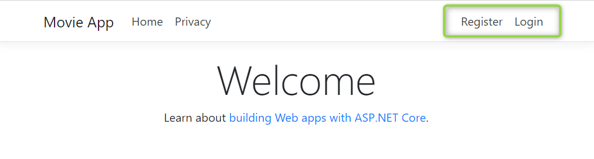
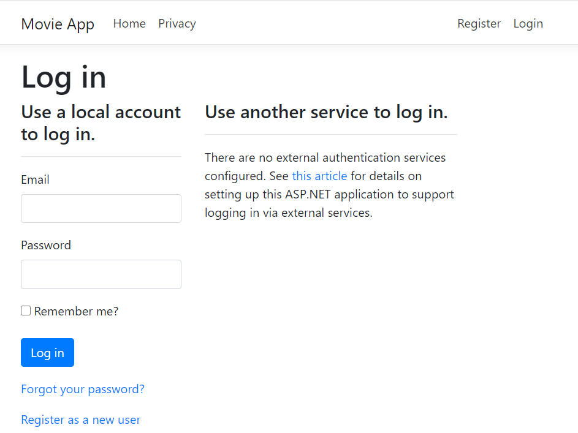
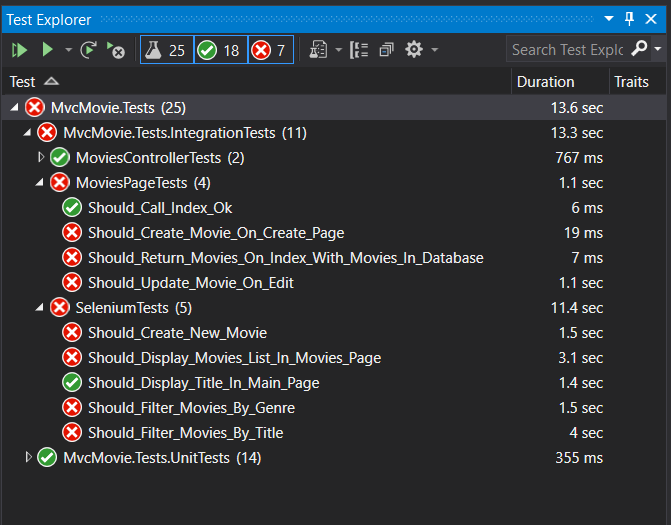
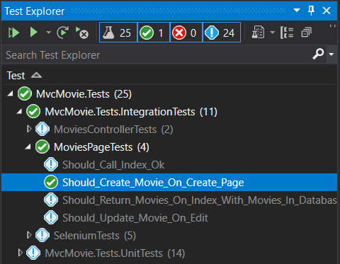
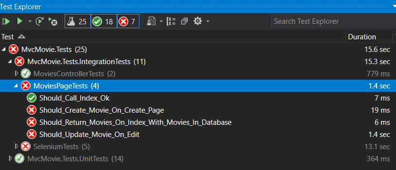
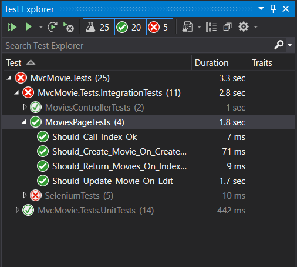

# Lab 5. Simular la autenticación

En este Lab vamos a ver cómo podemos simular un usuario logado en nuestro sistema, para realizar pruebas de integración y de UI sobre páginas o elementos solamente disponibles para usuarios logados.

Para ello, vamos a trabajar con la misma aplicación que hemos estado viendo durante este workshop, a la que hemos añadido [Asp.NET Core Identity](https://docs.microsoft.com/en-us/aspnet/core/security/authentication/identity?view=aspnetcore-3.1&tabs=visual-studio), lo que nos permite añadir formularios de login y registro a nuestra aplicación, respaldados por una base de datos en las que guardaremos nuestros usuarios.

**IMPORTANTE** -> se ha añadido una nueva entrada en el fichero appsettings.json con la connectionstring de esta nueva BBDD de usuarios:

````json
{
    ...
  "ConnectionStrings": {
    ...
    "MvcMovieIdentityContextConnection": "Server=(localdb)\\mssqllocaldb;Database=MvcMovie;Trusted_Connection=True;MultipleActiveResultSets=true"
  }
}
````
Dependiendo de cómo tengas configurado tu agente de BBDD probablemente tengas que cambiar la cadena de conexión.

Si arrancamos la aplicación ahora mismo, podremos ver que en el margen superior derecho tenemos las opciones para registrarnos o iniciar sesión:



Y si intentamos visitar la página Index (o cualquier otra acción) del controlador **MoviesController**, la aplicación nos redireccionará a la página de Login:



Ya que hemos protegido el controlador **MoviesController** con el atributo **Authorize** a nivel de clase:

````csharp
    [Authorize]
    public class MoviesController : Controller
    {
      ....
    }
````

Si ahora mismo ejecutamos los tests que tenemos definidos en la solución (son los mismos del ejercicio anterior), podremos ver que la mayoría de los tests que hemos escrito con Selenium o con WebApplicationFactory fallan:



# Paso 1. Implementar IAuthenticationService

Vamos a crear una clase que simule el comportamiento del componente **AuthenticationService**. Para ello, en nuestro proyecto de Tests, vamos a añadir una clase **MockAuthenticationService** dentro de la carpeta **Configuration**. Esta clase implementará la interfaz **IAuthenticationService**:

````csharp

namespace MvcMovie.Tests.Configuration
{
    public class MockAuthenticationService : IAuthenticationService
    {
        public async Task<AuthenticateResult> AuthenticateAsync(HttpContext context, string scheme)
        {
            var principal = new ClaimsPrincipal();
            principal.AddIdentity(new ClaimsIdentity(new Claim[]{
                new Claim(ClaimTypes.NameIdentifier,"TestIdentity")
                },scheme));
            return AuthenticateResult.Success(new AuthenticationTicket(principal,
                new AuthenticationProperties(), scheme));
        }

        public Task ChallengeAsync(HttpContext context, string scheme, AuthenticationProperties properties)
        {
            throw new NotImplementedException();
        }

        public Task ForbidAsync(HttpContext context, string scheme, AuthenticationProperties properties)
        {
            throw new NotImplementedException();
        }

        public Task SignInAsync(HttpContext context, string scheme, ClaimsPrincipal principal, AuthenticationProperties properties)
        {
            throw new NotImplementedException();
        }

        public Task SignOutAsync(HttpContext context, string scheme, AuthenticationProperties properties)
        {
            throw new NotImplementedException();
        }
    }
}
````
Si te fijas, solamente estamos implementando el método AuthenticateAsync, el resto nos da lo mismo :)

En el método AuthenticateAsync lo que nos creamos es un nuevo objeto de tipo ClaimsPrincipal y le añadimos una identidad con un claim por defecto asociado al mismo esquema de autenticación que ha recibido el método del mock por parámetro, y después de eso devolvemos un resultado Ok con un ticket de autenticación en el que devolvemos la identidad que hemos creado.

# Paso 2. Registrar el mock IAuthenticationService en el Test Server

Ahora vamos a configurar nuestro **CustomWebApplicationFactory** para registrar nuestro mock sustituyendo la implementación por defecto de **AuthenticationService**. Para ello, vamos a dar la opción de levantar el servidor de test simulando un usuario logado o no, así que en la clase **CustomWebApplicationFactory** vamos a añadir lo siguiente:

````csharp
        private IAuthenticationService authService;
        public CustomWebApplicationFactory<TStartup> WithUserLoggedIn()
        {
            authService = new MockAuthenticationService();
            return this;
        }
````
Y vamos a modificar el método **ConfigureWebHost** para añadirle lo siguiente:

````csharp
                if(authService != null)
                {
                    services.AddTransient<IAuthenticationService>(_ =>
                    {
                        return authService;
                    });
                }
````

este es el código completo del método:

````csharp
        protected override void ConfigureWebHost(IWebHostBuilder builder)
        {
            builder.ConfigureServices(services =>
            {
                RegisterAndFeedApplicationDatabase(services);
                RegisterAndFeedIdentityDatabase(services);

                if(authService != null)
                {
                    services.AddTransient<IAuthenticationService>(_ =>
                    {
                        return authService;
                    });
                }

                services.AddAntiforgery(t =>
                {
                    t.Cookie.Name = AntiForgeryTokenExtractor.AntiForgeryCookieName;
                    t.FormFieldName = AntiForgeryTokenExtractor.AntiForgeryFieldName;
                });
            });
        }
````

# Paso 3. añadir el método nuevo de CustomWebApplicationFactory en los tests que fallan.

Ahora que ya tenemos el método nuevo definido en nuestro **CustomWebApplicationFactory** solamente nos queda configurar nuestros tests para que llamen a este método antes de crear el cliente Http.

Vamos a empezar con el test **Should_Create_Movie_On_Create_Page** de la clase **MoviesPageTests**, simplemente cuando vayamos a crear el cliente http deberemos añadir la línea **WithUserLoggedIn**:

````csharp
            var client = factory
                .WithUserLoggedIn()
                .CreateClient();
````

Si guardas y ejecutas ahora el test de nuevo, verás algo similar a esto:



Pero, si ejecutas todos los tests de la clase **MoviesPageTests** verás algo parecido a esto:



¿Por qué ocurre esto? Porque, aunque estemos creando una nueva instancia de HttpClient con cada test dentro de nuestra clase, lo que está ocurriendo por debajo es que xUnit está **reutilizando** el objeto httpclient que se queda en memoria, con lo que si el primer Test que se ejecuta no está usando nuestro nuevo método **WithUserLoggedIn**, el cliente Http se crea sin el MockAuthenticationService registrado y.... bueno, falla :)

Qué podemos hacer? Bueno, podemos delegar la creación del objeto HttpClient en el constructor de la clase, y que cada clase se encargue de probar un escenario concreto:

Una clase que se encargue de probar la funcionalidad del controlador **Movies** simulando un usuario logado y otra clase que se encargue de probar la funcionalidad del controlador **Movies** simulando ser un usuario no logado en el sistema.

Así que vamos a modificar el contenido de nuestra clase **MoviesPageTests** por lo siguiente:

````csharp
using Microsoft.AspNetCore.Mvc.Testing;
using Microsoft.Net.Http.Headers;
using MvcMovie.Models;
using MvcMovie.Tests.Configuration;
using Newtonsoft.Json;
using System;
using System.Collections.Generic;
using System.Linq;
using System.Net.Http;
using System.Text;
using System.Threading.Tasks;
using Xunit;

namespace MvcMovie.Tests.IntegrationTests
{
    [Collection("Secuential Integration Tests")]
    public class MoviesPageTests:IClassFixture<CustomWebApplicationFactory<Startup>>
    {
        private readonly CustomWebApplicationFactory<Startup> factory;
        private HttpClient client;
        private const int TERMINATOR_MOVIE_ID = 1;
        private const int GREMLINS_MOVIE_ID = 2;
        public MoviesPageTests(CustomWebApplicationFactory<Startup> _factory)
        {
            factory = _factory;
            client = factory
                .WithMoviesInDatabase(GetMovies())                
                .CreateClient();
        }

        private List<Movie> GetMovies()
        {
            var terminatorMovie = new Movie() { Id = TERMINATOR_MOVIE_ID, Title = "Terminator 2", Genre = "Action" };
            return new List<Movie>() { terminatorMovie };
        }

        [Fact]
        public async Task Should_Call_Index_Ok()
        {
            // Arrange                        
            var expected = System.Net.HttpStatusCode.OK;

            // Act
            var response = await client.GetAsync("movies");
            response.EnsureSuccessStatusCode();
            
            // Assert
            Assert.NotNull(response);
            Assert.Equal(response.StatusCode, expected);                        
        }

        [Fact]
        public async Task Should_Return_Movies_On_Index_With_Movies_In_Database()
        {
            // Arrange               
            var expected = System.Net.HttpStatusCode.OK;
            var terminatorMovie = GetMovies().First(x => x.Id == TERMINATOR_MOVIE_ID);

            // Act
            var response = await client.GetAsync("movies");
            response.EnsureSuccessStatusCode();
            
            string content = await response.Content.ReadAsStringAsync();


            // Assert
            Assert.NotNull(response);
            Assert.Equal(response.StatusCode, expected);
            Assert.Contains(terminatorMovie.Title, content);            
        }

        [Fact]
        public async Task Should_Create_Movie_On_Create_Page()
        {
            // Arrange    
            var gremlinsMovie = new Movie() { Id= GREMLINS_MOVIE_ID, Title = "Gremlins", Genre = "Action" };

            var expected = System.Net.HttpStatusCode.OK;
            var response = await client.GetAsync("movies/create");
            response.EnsureSuccessStatusCode();
            var (fieldValue, cookieValue) = await AntiForgeryTokenExtractor.ExtractAntiForgeryValues(response);

            var postRequest = new HttpRequestMessage(HttpMethod.Post, "movies/create");
            postRequest.Headers.Add("Cookie",
                new CookieHeaderValue(AntiForgeryTokenExtractor.AntiForgeryCookieName,
                                    cookieValue).ToString());

            var formModel = new Dictionary<string, string>
            {
                { AntiForgeryTokenExtractor.AntiForgeryFieldName, fieldValue },
                { nameof(gremlinsMovie.Title), gremlinsMovie.Title },
                { nameof(gremlinsMovie.Genre), gremlinsMovie.Genre },
                { nameof(gremlinsMovie.Price), gremlinsMovie.Price.ToString() },
                { nameof(gremlinsMovie.ReleaseDate), gremlinsMovie.ReleaseDate.ToString() },
            };
            postRequest.Content = new FormUrlEncodedContent(formModel);


            // Act
            response = await client.SendAsync(postRequest);
            response.EnsureSuccessStatusCode();
            string content = await response.Content.ReadAsStringAsync();

            // Assert
            Assert.NotNull(response);
            Assert.Equal(response.StatusCode, expected);
            Assert.Contains(gremlinsMovie.Title, content);            
        }

        [Fact]
        public async Task Should_Update_Movie_On_Edit()
        {
            // Arrange    
            var terminatorMovie = GetMovies().First(x => x.Id == TERMINATOR_MOVIE_ID);
            client = factory
                .WithMoviesInDatabase(new List<Movie>() { terminatorMovie })                
                .CreateClient();
            terminatorMovie.Title = "Terminator 2: Judgment Day";
            var expected = System.Net.HttpStatusCode.OK;
            var response = await client.GetAsync($"movies/edit/{terminatorMovie.Id}");
            response.EnsureSuccessStatusCode();
            var (fieldValue, cookieValue) = await AntiForgeryTokenExtractor.ExtractAntiForgeryValues(response);

            var postRequest = new HttpRequestMessage(HttpMethod.Post, $"movies/edit/{terminatorMovie.Id}");
            postRequest.Headers.Add("Cookie",
                new CookieHeaderValue(AntiForgeryTokenExtractor.AntiForgeryCookieName,
                                    cookieValue).ToString());

            var formModel = new Dictionary<string, string>
            {
                { AntiForgeryTokenExtractor.AntiForgeryFieldName, fieldValue },
                { nameof(terminatorMovie.Title), terminatorMovie.Title },
                { nameof(terminatorMovie.Genre), terminatorMovie.Genre },
                { nameof(terminatorMovie.Price), terminatorMovie.Price.ToString() },
                { nameof(terminatorMovie.ReleaseDate), terminatorMovie.ReleaseDate.ToString() },
            };
            postRequest.Content = new FormUrlEncodedContent(formModel);


            // Act
            response = await client.SendAsync(postRequest);
            response.EnsureSuccessStatusCode();
            string content = await response.Content.ReadAsStringAsync();

            // Assert
            Assert.NotNull(response);
            Assert.Equal(response.StatusCode, expected);
            Assert.Contains(terminatorMovie.Title, content);            
        }

    }
}

````

Con esto hemos refactorizado nuestros tests para que utilicen siempre el mismo cliente Http, ahora, en el constructor de la clase, deberemos añadir la línea **.WithUserLoggedIn()**:

````csharp
        public MoviesPageTests(CustomWebApplicationFactory<Startup> _factory)
        {
            factory = _factory;
            client = factory
                .WithMoviesInDatabase(GetMovies()) 
                .WithUserLoggedIn()
                .CreateClient();
        }
````
Si después de esto ejecutas los tests de esta clase, verás que todos finalizan correctamente:



# Paso 4. Actualizar los tests de Selenium

Ahora actualiza tu los tests de Selenium para que utilicen el nuevo método **WithUserLoggedIn()** de **CustomWebApplicationFactory**

**Recuerda**: **SeleniumServerFactory** es _hija_ de **CustomWebApplicationFactory**

# Paso 5. Cambiar el nombre de las clases de Test de Integración y UI

Ahora mismo tenemos dos clases de test que ejecutan tests de integración simulando un usuario logado:

- **MoviesPageTests**
- **SeleniumTests**

Vamos a cambiar el nombre de estas dos clases para que cuando alguien abra la solución pueda identificar fácilmente qué es exactamente el escenario que están probando estas dos clases:

- MoviesPageTests -> Movies_Page_With_Logged_In_User
- SeleniumTests -> UI_Movies_With_Logged_In_User

# Paso 6. Crear tests para un usuario no logado en el sistema

Vamos a crear dos clases de test para simular un visitante no logado en el sistema, para ello, dentro de la carpeta **IntegrationTests** vamos a crear dos clases:

- Movies_Page_With_Anonymous_User
- UI_Movies_With_Anonymous_User

````csharp
using MvcMovie.Tests.Configuration;
using System.Net.Http;
using Xunit;
namespace MvcMovie.Tests.IntegrationTests
{
    [Collection("Secuential Integration Tests")]
    public class Movies_Page_With_Anonymous_User : IClassFixture<CustomWebApplicationFactory<Startup>>
    {
        private readonly CustomWebApplicationFactory<Startup> factory;
        private HttpClient client;
        public Movies_Page_With_Anonymous_User(CustomWebApplicationFactory<Startup> _factory)
        {
            factory = _factory;
        }
    }
}
````

````csharp
using MvcMovie.Tests.Configuration;
using OpenQA.Selenium;
using OpenQA.Selenium.Chrome;
using OpenQA.Selenium.Remote;
using System;
using System.Net.Http;
using Xunit;

namespace MvcMovie.Tests.IntegrationTests
{
    [Collection("Secuential Integration Tests")]
    public class UI_Movies_With_Anonymous_User : IClassFixture<SeleniumServerFactory<Startup>>, IDisposable
    {
        public SeleniumServerFactory<Startup> Server;
        public IWebDriver Browser;
        public HttpClient Client;

        public UI_Movies_With_Anonymous_User(SeleniumServerFactory<Startup> server)
        {
            Server = server;
            Client = Server                   
                    .CreateClient();
            var opts = new ChromeOptions();
            opts.AddArgument("--headless");
            opts.SetLoggingPreference(OpenQA.Selenium.LogType.Browser, LogLevel.All);

            var driver = new RemoteWebDriver(opts);
            Browser = driver;
        }

        public void Dispose()
        {
            Browser.Dispose();
            Client.Dispose();
        }
    }
}

````

La clase **UI_Movies_With_Anonymous_User** utilizará Selenium para ejecutar las pruebas mientras que la clase **Movies_Page_With_Anonymous_User** utilizará simplemente la clase CustomWebApplicationFactory.

Escribe un test para cada clase que compruebe que si un usuario anónimo intenta navegar hasta el endpoint "/movies" será redirigido a la página de Login.

