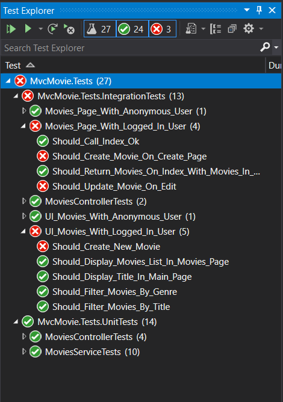

# Lab6. Simular la autorización

En este Lab vamos a ver cómo podemos simular el proceso de autorización en nuestros tests de integración y de UI.

Para ello vamos a partir de la aplicación anterior, a la que habíamos habilitado autenticación con Asp.NET Core Identity.

En el lab anterior vimos cómo testear el acceso de usuarios anónimos y logados en nuestro sistema.

En este Lab vamos a ver cómo añadir testear nuestra aplicación en un escenario en el que:

- Los usuarios registrados pueden ver el listado de las películas y consultar el detalle de una película.

- Los usuarios con el rol de "Editor" pueden ver el listado de las películas, consultar el detalle de una película, dar de alta películas nuevas y editar películas existentes.

- Los usuarios con el rol de "Administrator" pueden hacer lo mismo que los usuarios con el rol de Edición y además pueden eliminar películas del catálogo.

# Paso 1. Definir las directivas

Vamos a añadir las siguientes directivas en nuestro código:

- CanViewMovies
- CanEditMovie
- CanCreateMovie
- CanDeleteMovie

Para ello, vamos a añadir en el método **ConfigureServices** de la clase **Startup** de nuestra aplicación lo siguiente:

````csharp
services.AddAuthorization(options =>
            {
                options.AddPolicy("CanViewMovies", policy =>
                {
                    policy.RequireAuthenticatedUser();
                });
                options.AddPolicy("CanEditMovie", policy =>
                {
                    policy.RequireRole("Editor","Administrator");
                });
                options.AddPolicy("CanCreateMovie", policy =>
                {
                    policy.RequireRole("Editor", "Administrator");
                });
                options.AddPolicy("CanDeleteMovie", policy =>
                {
                    policy.RequireRole("Administrator");
                });
            });
````

este sería el código completo del método **ConfigureServices**:

````csharp
        public virtual void ConfigureServices(IServiceCollection services)
        {
            services.Configure<CookiePolicyOptions>(options =>
            {
                // This lambda determines whether user consent for non-essential cookies is needed for a given request.
                options.CheckConsentNeeded = context => true;
                options.MinimumSameSitePolicy = SameSiteMode.None;
            });

            services.AddTransient<IMoviesService, MoviesService>();
            services.AddTransient<IMoviesRepository, MoviesRepository>();
            ConfigureApplicationDatabase(services);
            ConfigureAuthentication(services);

            services.AddAuthorization(options =>
            {
                options.AddPolicy("CanViewMovies", policy =>
                {
                    policy.RequireAuthenticatedUser();
                });
                options.AddPolicy("CanEditMovie", policy =>
                {
                    policy.RequireRole("Editor","Administrator");
                });
                options.AddPolicy("CanCreateMovie", policy =>
                {
                    policy.RequireRole("Editor", "Administrator");
                });
                options.AddPolicy("CanDeleteMovie", policy =>
                {
                    policy.RequireRole("Administrator");
                });
            });
            
            services.AddControllersWithViews();
            services.AddRazorPages();
        }
````

Ahora, vamos a modificar las acciones del controlador **MoviesController** para filtrar cada acción por la policy correcta.

**IMPORTANTE**: En el ejemplo de debajo he omitido el cuerpo de cada función, no copies y sustituyas el contenido de la clase completa! ve añadiendo el decorador **Authorize** con la policy correcta en el controlador y en cada uno de sus métodos:

````csharp
namespace MvcMovie.Controllers
{
    [Authorize(Policy ="CanViewMovies")]
    public class MoviesController : Controller
    {
        private readonly IMoviesService service;
        public MoviesController(IMoviesService _service)
        {            
            service = _service;
        }

        // GET: Movies
        public async Task<IActionResult> Index(string movieGenre, string searchString)
        {
            ...
        }

        // GET: Movies/Details/5
        public async Task<IActionResult> Details(int? id)
        {
            ...
        }

        // GET: Movies/Create
        [Authorize(Policy = "CanCreateMovie")]
        public IActionResult Create()
        {
            ...
        }

        // POST: Movies/Create
        // To protect from overposting attacks, please enable the specific properties you want to bind to, for 
        // more details see http://go.microsoft.com/fwlink/?LinkId=317598.
        [Authorize(Policy = "CanCreateMovie")]
        [HttpPost]
        [ValidateAntiForgeryToken]
        public async Task<IActionResult> Create([Bind("Id,Title,ReleaseDate,Genre,Price")] Movie movie)
        {
            ...
        }

        // GET: Movies/Edit/5
        [Authorize(Policy = "CanEditMovie")]
        public async Task<IActionResult> Edit(int? id)
        {
            ...
        }

        // POST: Movies/Edit/5
        // To protect from overposting attacks, please enable the specific properties you want to bind to, for 
        // more details see http://go.microsoft.com/fwlink/?LinkId=317598.
        [Authorize(Policy = "CanEditMovie")]
        [HttpPost]
        [ValidateAntiForgeryToken]
        public async Task<IActionResult> Edit(int id, [Bind("Id,Title,ReleaseDate,Genre,Price")] Movie movie)
        {
            ...
        }

        // GET: Movies/Delete/5
        [Authorize(Policy = "CanDeleteMovie")]
        public async Task<IActionResult> Delete(int? id)
        {
            ...
        }


        // POST: Movies/Delete/5
        [Authorize(Policy = "CanDeleteMovie")]
        [HttpPost, ActionName("Delete")]
        [ValidateAntiForgeryToken]
        public async Task<IActionResult> DeleteConfirmed(int id)
        {
            ...
        }
    }
}

````

¿Por qué el método **Index** y el método **Details** van sin decorador? Porque al indicar un decorador a nivel de clase, la policy que hemos definido a niveld e clase aplica a los métodos de dentro de la clase.

Si ahora arrancamos la aplicación y hacemos login con nuestro usuario (si no lo has hecho aún, regístrate en la aplicación usando una dirección de correo y una password), al no tener un rol asignado a nuestro usuario, la aplicación solo nos dejará entrar a las acciones que hemos marcado con la policy **CanVewMovies**, si intentamos editar, crear o eliminar una película, la aplicación nos redirigirá a la siguiente página:


Ahora, si ejecutamos los tests tal y como los terminamos en el lab anterior, obtendremos el siguiente resultado:



Es normal, fallan los tests para las acciones de Create y Edit, porque la clase MockAuthenticationService no está asociando ningún Rol al simular un usuario logado, con lo que los tests se ejecutan con un usuario sin rol.

Para arreglar los tests que fallan, momentáneamente vamos a modificar el método **AuthenticateAsync** de la clase **MockAuthenticationService** (dentro de la carpeta **Configuration** de nuestro proyecto de tests):

````csharp
        public async Task<AuthenticateResult> AuthenticateAsync(HttpContext context, string scheme)
        {
            var principal = new ClaimsPrincipal();
            principal.AddIdentity(new ClaimsIdentity(new Claim[]{
                new Claim(ClaimTypes.NameIdentifier,"TestIdentity"),
                new Claim(ClaimTypes.Role, "Administrator")
                },scheme));
            return AuthenticateResult.Success(new AuthenticationTicket(principal,
                new AuthenticationProperties(), scheme));
        }
````

Con esto, al construir el objeto **ClaimsPrincipal** estamos añadiendo un claim de tipo rol con el rol de Administrador, con lo que nos aseguramos que los tests no fallan.

Ahora, vamos a renombrar las clases de Test

- Movies_Page_With_Logged_In_User -> Movies_Page_With_Administrator_User
- UI_Movies_With_Logged_In_User -> UI_Movies_With_Administrator_User

Si volvemos a ejecutar de nuevo todos los tests tras haber efectuado los pasos anteriors, veremos que todos los tests se ejecutan correctamente.

# Paso 2. Modificaciones en MockAuthenticationService

Ahora mismo estamos en un escenario en que siempre que utilicemos nuestro MockAuthenticationService obtendremos un usuario logado con el rol administrador, pero lo que nosotros queremos es testear como se comportaría el sistema con diferentes usuarios logados, con lo que tenemos que ver la forma de generar estos usuarios de forma automática.

Vamos a crear otro Builder que se encargue de inicializar este tipo de identidades, para ello, dentro de la carpeta **Configuration** de nuestro proyecto de Tests, vamos a crear una clase llamada **MockIdentityBuilder**

````csharp
using System.Collections.Generic;
using System.Security.Claims;

namespace MvcMovie.Tests.Configuration
{
    public class MockIdentityBuilder
    {
        private List<Claim> claims;

        public MockIdentityBuilder()
        {
            this.claims = new List<Claim>();            
        }
        public MockIdentityBuilder WithName(string name)
        {
            this.claims.Add(new Claim(ClaimTypes.NameIdentifier, name));
            return this;
        }
        public MockIdentityBuilder WithRole(string role)
        {
            this.claims.Add(new Claim(ClaimTypes.Role, role));
            return this;
        }
        public ClaimsIdentity Identity
        {
            get
            {
                return new ClaimsIdentity(claims);
            }
        }
    }
}
````

Ahora, vamos a modificar la clase **MockAuthenticationService** para añadirle una propiedad readonly de tipo **ClaimsIdentity** e inyectársela en el constructor, y modificaremos el método **AuthenticateAsync** para crear un objeto ClaimsPrincipal a partir de los claims de la propiedad que vamos a añadir a la clase.

También vamos a modificar el método **ForbidAsync** , ya que cuando la petición no cumpla con las policies que hemos definido, el middleware de Autorización llamará a este método:

````csharp
public class MockAuthenticationService : IAuthenticationService
    {
        private readonly ClaimsIdentity identity;
        public MockAuthenticationService(ClaimsIdentity _identity)
        {
            identity = _identity;
        }           
        public async Task<AuthenticateResult> AuthenticateAsync(HttpContext context, string scheme)
        {
            var principal = new ClaimsPrincipal();
            principal.AddIdentity(new ClaimsIdentity(identity.Claims,scheme));
            return AuthenticateResult.Success(new AuthenticationTicket(principal,
                new AuthenticationProperties(), scheme));
        }
        
        public async Task ForbidAsync(HttpContext context, string scheme, AuthenticationProperties properties)
        {
            context.Response.Redirect($"http://{context.Request.Host}/Identity/Account/AccessDenied");
            return;
        }
        ...
    }      
````

Este es el contenido completo de la clase **MockAuthenticationService**:

````csharp
using Microsoft.AspNetCore.Authentication;
using Microsoft.AspNetCore.Http;
using System;
using System.Security.Claims;
using System.Threading.Tasks;

namespace MvcMovie.Tests.Configuration
{
    public class MockAuthenticationService : IAuthenticationService
    {
        private readonly ClaimsIdentity identity;
        public MockAuthenticationService(ClaimsIdentity _identity)
        {
            identity = _identity;
        }           
        public async Task<AuthenticateResult> AuthenticateAsync(HttpContext context, string scheme)
        {
            var principal = new ClaimsPrincipal();
            principal.AddIdentity(new ClaimsIdentity(identity.Claims,scheme));
            return AuthenticateResult.Success(new AuthenticationTicket(principal,
                new AuthenticationProperties(), scheme));
        }

        public Task ChallengeAsync(HttpContext context, string scheme, AuthenticationProperties properties)
        {
            throw new NotImplementedException();
        }

        public async Task ForbidAsync(HttpContext context, string scheme, AuthenticationProperties properties)
        {
            context.Response.Redirect($"http://{context.Request.Host}/Identity/Account/AccessDenied");
            return;
        }

        public Task SignInAsync(HttpContext context, string scheme, ClaimsPrincipal principal, AuthenticationProperties properties)
        {
            throw new NotImplementedException();
        }

        public Task SignOutAsync(HttpContext context, string scheme, AuthenticationProperties properties)
        {
            throw new NotImplementedException();
        }
    }
}

````

Ahora, vamos a modificar el método **WithUserLoggedIn** d la clase **CustomWebApplicationFactory** para pasarle un objeto de tipo **ClaimsIdentity**:

````csharp

        private IAuthenticationService authService;
        public CustomWebApplicationFactory<TStartup> WithUserLoggedIn(ClaimsIdentity identity)
        {
            authService = new MockAuthenticationService(identity);
            return this;
        }
````

Y por último, vamos a modificar los constructores de nuestras clases de tests
-   Movies_Page_With_Administrator_User
-   UI_Movies_With_Administrator_User

Para utilizar el Builder que hemos creado en el inicio de este ejercicioy crear una identidad con rol de Administrador:

````csharp
        public Movies_Page_With_Administrator_User(CustomWebApplicationFactory<Startup> _factory)
        {
            factory = _factory;
            client = factory
                .WithMoviesInDatabase(GetMovies()) 
                .WithUserLoggedIn(
                        new MockIdentityBuilder()
                        .WithRole("Administrator")
                        .Identity)
                .CreateClient();
        }
````

````csharp
        public UI_Movies_With_Administrator_User(SeleniumServerFactory<Startup> server)
        {
            Server = server;
            Client = Server
                    .WithMoviesInDatabase(GetMovies())
                    .WithUserLoggedIn(
                        new MockIdentityBuilder()
                                .WithRole("Administrator")
                                .Identity)
                    .CreateClient();            
            var opts = new ChromeOptions();
            opts.AddArgument("--headless");
            opts.SetLoggingPreference(OpenQA.Selenium.LogType.Browser, LogLevel.All);

            var driver = new RemoteWebDriver(opts);
            Browser = driver;            
        }
````

Con esto ya tenemos nuestros tests preparados para simular diferentes usuarios logados en la aplicación. :)

# Paso 3. Comprobar policies para los usuarios logados sin permisos

Vamos a crear dos clases de test que comprueben el comportamiento de la aplicación respecto a los usuarios logados que no tienen rol de Administrador o de Editor, si nos acordamos, este tipo de usuarios:

- No pueden crear películas
- No pueden editar películas
- No pueden eliminar películas

El comportamiento esperado es que si los usuarios intentan visitar alguna de las páginas que permiten realizar alguna acción de este tipo, el sistema les redireccionará a la página de /Identity/Account/AccessDenied

Vamos a crear dos clases para estas pruebas, dentro de la carpeta **IntegrationTests**, una que utilice el driver de Selenium y otra que utilice solamente WebApplicationFactory:

- UI_Movies_With_Signed_In_User
- Movies_Page_With_Signed_In_User

Como en las siguientes pruebas vamos a necesitar inicializar la base de datos, y ya tenemos un método en la clase **UI_Movies_With_Administrator_User** que se llama **GetMovies** y que devuelve un listado de películas, vamos a llevarnos este método a una clase estática que llamaremos **MoviesCatalog** y que pondremos dentro de la carpeta **Configuration**:

**IMPORTANTE** : he modificado un poco el método para añadir los ids a las películas, para poder trabajar más adelante con ellas seleccionándolas por el id.

````csharp
public class MoviesCatalog
    {
        public static List<Movie> GetMovies()
        {
            return new List<Movie>() {
                    new Movie
                    {
                        Id = 10,
                        Title = "When Harry Met Sally",
                        ReleaseDate = DateTime.Parse("1989-2-12"),
                        Genre = "Romantic Comedy",
                        Price = 7.99M
                    },
                    new Movie
                    {
                        Id = 11,
                        Title = "Ghostbusters ",
                        ReleaseDate = DateTime.Parse("1984-3-13"),
                        Genre = "Comedy",
                        Price = 8.99M
                    },
                    new Movie
                    {
                        Id = 12,
                        Title = "Ghostbusters 2",
                        ReleaseDate = DateTime.Parse("1986-2-23"),
                        Genre = "Comedy",
                        Price = 9.99M
                    },
                    new Movie
                    {
                        Id = 13,
                        Title = "Rio Bravo",
                        ReleaseDate = DateTime.Parse("1959-4-15"),
                        Genre = "Western",
                        Price = 3.99M
                    }};
        }
    }
````
y a partir de ahora utilizaremos este componente para llenar la base de datos de nuestras pruebas, vamos a crear las dos clases de test:


````csharp
[Collection("Secuential Integration Tests")]
    public class Movies_Page_With_Signed_In_User : IClassFixture<CustomWebApplicationFactory<Startup>>
    {
        private readonly CustomWebApplicationFactory<Startup> factory;
        private HttpClient client;

        public Movies_Page_With_Signed_In_User(CustomWebApplicationFactory<Startup> _factory)
        {
            factory = _factory;
            client = factory
                .WithMoviesInDatabase(MoviesCatalog.GetMovies())
                .WithUserLoggedIn(
                        new MockIdentityBuilder()
                        .WithName("Test User")
                        .Identity)
                .CreateClient();
        }

        [Fact]
        public async Task Should_Return_Access_Denied_When_Try_To_Visit_Create_Movie_Page()
        {

        }

        [Fact]
        public async Task Should_Return_Access_Denied_When_Try_To_Visit_Update_Movie_Page()
        {

        }
        [Fact]
        public async Task Should_Return_Access_Denied_When_Try_To_Visit_Delete_Movie_Page()
        {

        }
    }
````

````csharp
[Collection("Secuential Integration Tests")]
    public class UI_Movies_With_Signed_In_User : IClassFixture<SeleniumServerFactory<Startup>>, IDisposable
    {
        public SeleniumServerFactory<Startup> Server;
        public IWebDriver Browser;
        public HttpClient Client;

        public UI_Movies_With_Signed_In_User(SeleniumServerFactory<Startup> server)
        {
            Server = server;
            Client = Server
                    .WithMoviesInDatabase(MoviesCatalog.GetMovies())
                    .WithUserLoggedIn(
                        new MockIdentityBuilder()
                               .WithName("Test User")
                                .Identity)
                    .CreateClient();
            var opts = new ChromeOptions();
            opts.AddArgument("--headless");
            opts.SetLoggingPreference(OpenQA.Selenium.LogType.Browser, LogLevel.All);

            var driver = new RemoteWebDriver(opts);
            Browser = driver;
        }

        [Fact]
        public async Task Should_Return_Access_Denied_When_Try_To_Visit_Create_Movie_Page()
        {

        }

        [Fact]
        public async Task Should_Return_Access_Denied_When_Try_To_Visit_Update_Movie_Page()
        {

        }
        [Fact]
        public async Task Should_Return_Access_Denied_When_Try_To_Visit_Delete_Movie_Page()
        {

        }

        
        public void Dispose()
        {
            Browser.Dispose();
            Client.Dispose();            
        }
    }
````

Escribe los tests para cada uno de los tres métodos de las dos clases. Si te atascas o te encuentras con algún problema, aquí tienes una posible [solución](soluciones.md)


